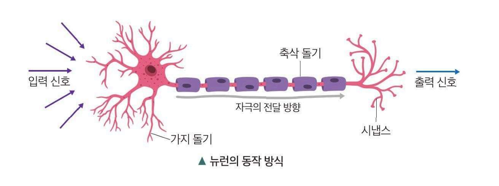
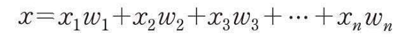
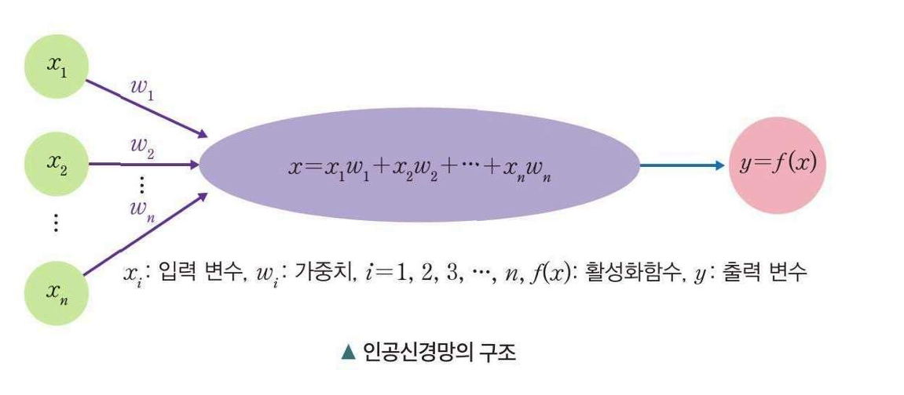
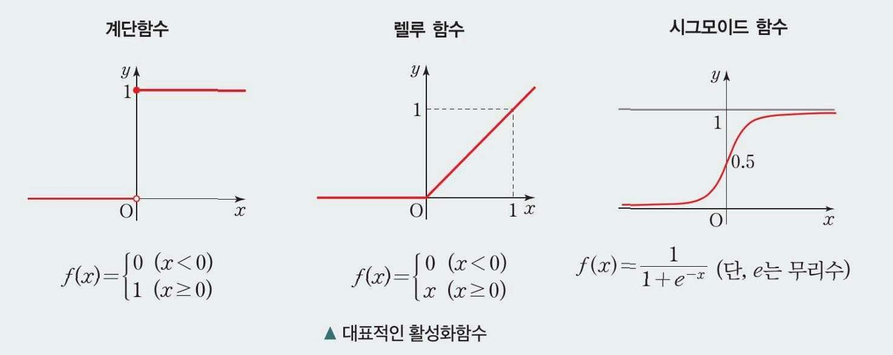
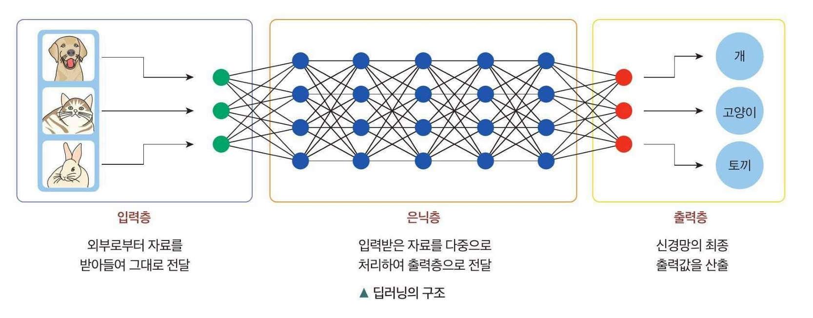
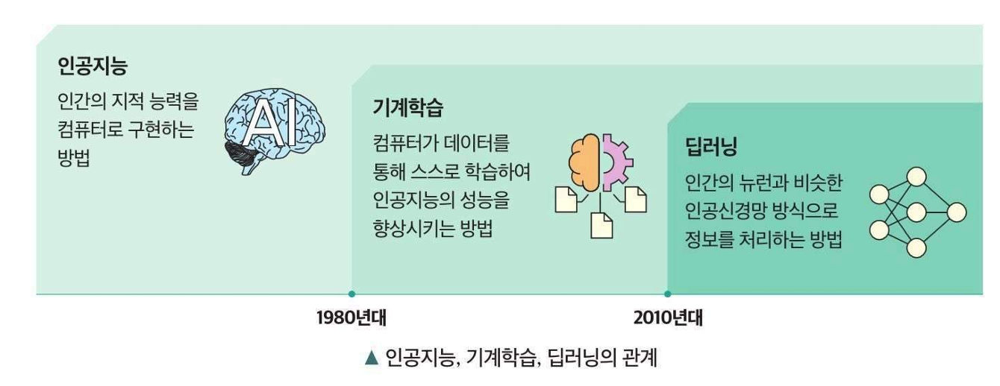
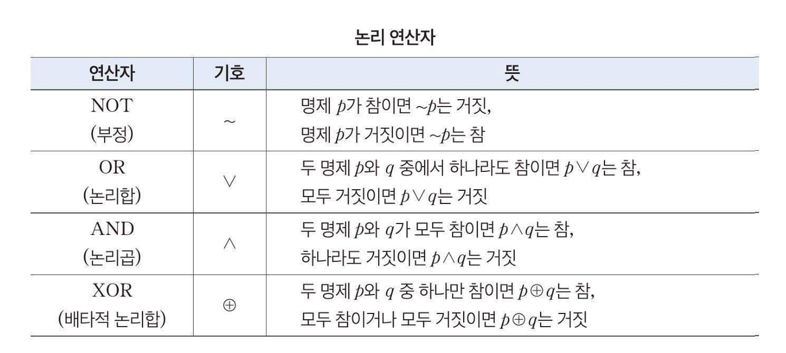

# 인공지능

학습목표 : 인공지능의 개념을 이해하고, 인공지능 학습 방식을 수학적으로 해석이 가능

## 인공지능은 무엇인가

인공지능은 인식, 학습, 추론 행동과 같은 인간의 지적능력이나 사고과정을 컴퓨터가 실행할 수있도록 구현하는 기술을 말한다.

인공지능은 데이터, 모델, 학습이라는 세가지 핵심 구성요소를 통해 스스로 판단하고 논리적인 사고와 행위를 수행한다, 이중 수학은 인공지능의 핵심적 도구이다

* 데이터
  * 수학의 집합, 백터 그리고 행렬의 개념을 이요하여 데이터 프로그램이 이해하고 처리하기 적합한 형태로 변환
* 모델
  * 현실세계의 복잡한 관계를 수학적으로 표현, 주로 함수위 형태로 표현
* 학습
  * 주어진 데이터를 활용, 모델을 최적화하는 과정으로 이를위한 알고리즘은 미분과 확률등 수학적 원리를 기반으로 한다,
  * 수학은 학습 알고리즘 설계와 최적화에 큰 역할을 하며, 이를 통해 인공지능은 주어진 데이터를 바탕으로 스스로 개선하고 발전

## 인공지능에서 어떻게 학습할까

### 기계학습

알고리즘을 연구하고 구현하는 대표기술로 사람이 학습하듯 컴퓨터가 주어진 자료를 스스로 학습하여 문제를 해결

기계학습은 학습 방법에 따라 지도학습, 비지도 학습, 강화 학습으로 분류가 가능하다

#### 지도학습

입력값과 출력값을 주고 학습시키는 방법, 처음부터 문제와 정잡을 모두 제공하고 이를 통해 학습 데이터를 기반으로 새로운 입력값에 대한 합리적은 출력값을 도출

학습하도록 주는 데이터를 훈련데이터 라하고 훈련에 답을 달아주는것을 레블링이라고 한다,

지도학습 활용 사례

* 스팸 메일분류
* 질병 유무 판단
* 사진속 인물 설별 구분
* 날씨 예측

#### 비지도학습

기계가 정답이 제공되지 않는 데이터를 학습하여 스스로 새루운 정보를 찾아낸느 학습 방법이다.

비지도 학습 활용 사례

* 쇼핑몰에서 추천상품
* 대형 식료품에서 구입정보를 바탕을 분류한 회원 그룹별 마케팅

#### 강화 학습

현재 상태에대해 어떤 행동을 하는 것이 최적인지를 찾아내는 학습 방법이다, 각 행동에 따라 주어지는 보상을통해 최적의 행동이 강화되도록 학습

강화 학습 사례

* 자율자동차 시뮬레이션
* 동작 모방 로봇제어
* 전략 게임 인공지능

## 인공지능은 어떻게 인간처럼 사고하는가

딥러닝은 인간의 두퇴에서 영감을 얻은 기계학습 방식 중 하나

#### 인공신경망의 구조

인간의 뇌는 뉴런(신경세포)신경세포로 구성된다, 뉴런은 가지돌기에서 신호를 받아 축삭 돌기로 신호를 보낸다, 이때 각 돌기에서 받은 신호세기의 합이 일정한 값을 넘는 경우에만 시냅스를 통해 다름 뉴런으로 신호를 전달한다.

이와 같이 뉴런을 본뜬 것이 인공신경망이다. 인공신경망은 n개의 입력 변수(x)에 대응하는 n개의 가중치(w 각 입력값에 곱하여 입력신호가 출력 신호에 미치는 중요도를 조절하는 변수)를 각각 곱하여 더한ㄱ값

이 주어진 값 C 보다 크면 1 아니면 0을 출력할때 이때 C를 **임계값** 이라고 한다.

함수 f 처럼 각 입력 번수와 가중치를 곱하여 더한 값이 x의 임계값보다 큰지 작은지를 구별한 후 x의 값을 출력변수 y에 대응하는 함수를 **활성화 함수**라고 한다,

활성화 함수는 인공 신경망에 입력된 값을 적절하게 변환시켜 출력하는 역할을 한다, 위와 같이 다수의 값을 입력받아 하나의 값으로 출력하는 구조의 인공신경망을 **퍼셉트론(Perceptron)** 이라고 한다.

#### 대표적인 활성 함수

단순한 직선형태의 함수를 사용하면 층을 깊게 하는 의미가 줄어들기에 신경망에서는 층을 쌓기 위해서 단순한 직선 형태가 아닌 함수를 활성화 함수로 사용한다.

활성화 함수의 대표적 형태로는 계단함수, 렐루 함수, 시그모이드 함수가 있다. 활성화 함수의 출력 변수의 값은 0이상 1이하인 경우가 많다.

### 딥러닝

퍼셉트론을 이용하여 작동되도록 기계학습 방식을 **딥러닝** 이라고 한다. 딥러닝은 정보처리 과정에서 여러층으로 구성된 학습모델을 사용하며, 심층 학습이라고 표현된다.

입력값을 보내는 단계를 입력층이라하고, 값을 받아서 출력하는 단계를 출력층이라고 한다, 딥러닝은 입력값과 출력값 사이를 연결하는 복잡한 인공신경 연결망 형태를 띠고 있으며, 입력층과 출력층 사이에 은닉층이 존재한다, 이때 입력 출력층만 있으면 **단층 펏셉트론** 이라하고 은닉층이 1개 이상이면 **다층 퍼셉트론**이라고 한다.

딥러닝에는 행렬, 확률, 통계, 미분, 기하 등 많은 수학적 원리가 적용된다, 그래서 수학적 원리를 이해해야 인공지능을 이해가 가능하다. 인공지능, 기계학습, 딥러닝의 관계를 생각할때 아래와 같다.

# 인공지능의 역사 속 수학의 역할

학습목표 : 인공지능에서 수학을 활용한 역사적 사례를 탐구 와 설명

### 논린 연산은 무었일까?

참 또는 거짓을 구분하는 식을 **명제** 라고 하고, 명제의 참과 거짓을 **진리값**이라고 한다, 명제가 참이면 T 거짓이면 F로 나타낸다 프로그래밍은 참을 1, 거짓을 0으로 나타낸다.

