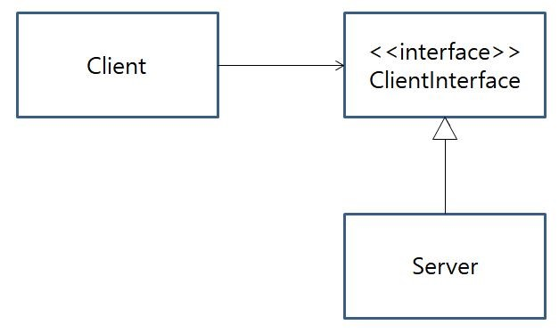

# OCP : Open-Closed Principle
> 기존 구성요소는 수정이 일어나지 말아야하며 쉽게 확장이 가능하여 재사용이 될수 있어야한다 
> 
OCP는 요구사항이 변경될때 기존 코드를 변경하는것이 아니라 새로운 코드를 추가하는 방향을 추구하는 원칙이다. 인터페이스 기반으로 설계 구현하여 해결해하는게 좋은방법이라고 할수있다.  
## **[추상화가 답이다]**
OCP를 따르지 않는 간단한 설계의 예시
<br>
Clinet와 Server 모두 구체 클래스 이기 떄문에 만약 Client가 다른서버를 사용한다면 Client클래스를 수정해야한다 바람직한 설계로 대체한 예시는 아래와 같다.
<br>
이러한 구현 방식을 스트래터지 패턴, 전략패턴이라고 한다. 여기서 말하는 전략은 Server클래스르 의미하며, Client는 목적에 맞는 서버를 선택할수 있다. Client는 인터페이스에 의존하지만 실제로는 Server객체를 사용하는것이므로 Server가 바뀌어도 Client는 수정할 필요가없다.  
  
* 코드레벨에서 OCP를 적용하는 방법
  * 상속
    * 상위 클래스가 바뀌면 하위 클래스에 끼치는 영향이 매우크다 라는 단점이 있다.
    * 상위 클래스와 하위 클래스의 강항 응집력으로 단점
  * 컴포지션
    * 변경(확장) 될 것과 변하지 않을것을 명확하게 구분한다는 장점
    * 두 모듈이 만나는 지점에 인터페이스를 지정하는 방식으로 구현에 의존하는 것이 아니라 정의한 인터페이스에 의존하도록 코드를 작성
* 컴포지션 적용방법
  1. 변경될 것과 변경하지 않을 부분을 구분하여 변경된부분을 인터페이스로 추출한다
  2. 모듈이 만나는 지점에 인터페이스를 정의한다
  3. 인터페이스에 의존하도록 코드를 작성한다.
* 전략패턴
  * OCP를 준수하기 위한 디자인 패턴
  * 즉, 컴포지션 적용 방법자체도 전략패턴이라고 볼 수 있다.
  * 전략을 쉽게 변경해줄수 있는 디자인 패턴, 행위클래스로 캡슐화해 동적으로 행위를 자유롭게 바꿔주는 패턴이다
  * 가장 큰 장점은 새로운 기능의 추가가 기존코드에 영향을 미치지 못하게 되면서 OCP를 만족한다.<br>

## **예제**
```c#
public interface PaymentMethod {
    bool ProcessPayment(decimal amount);
}

public class CreditCardPayment : PaymentMethod {
    public bool ProcessPayment(decimal amount) {
        // Call the credit card payment gateway API
        // and return true or false based on the response
    }
}

public class BankTransferPayment : PaymentMethod {
    public bool ProcessPayment(decimal amount) {
        // Call the bank transfer payment gateway API
        // and return true or false based on the response
    }
}

public class PayPalPayment : PaymentMethod {
    public bool ProcessPayment(decimal amount) {
        // Call the PayPal payment gateway API
        // and return true or false based on the response
    }
}

public class PaymentProcessor {
    private readonly PaymentMethod paymentMethod;

    public PaymentProcessor(PaymentMethod paymentMethod) {
        this.paymentMethod = paymentMethod;
    }

    public bool ProcessPayment(decimal amount) {
        return paymentMethod.ProcessPayment(amount);
    }
}

var creditCardPaymentMethod = new CreditCardPayment();
var paymentProcessor = new PaymentProcessor(creditCardPaymentMethod);

bool paymentSuccessful = paymentProcessor.ProcessPayment(100.00m);

```
   
서비스 운영 도중 추가/변경/삭제가 될것이 분명할때 OCP를 도입하기 좋은 케이스이다.