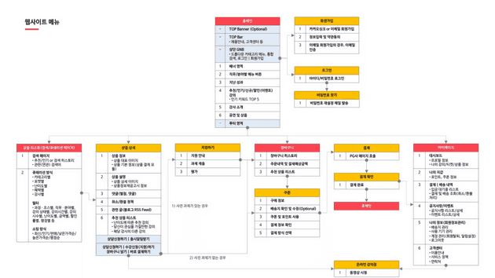
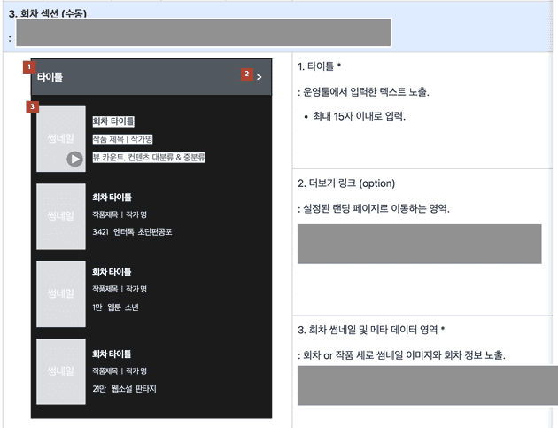

# **SRP**
## **단일 책임원칙**
> 컴포넌트는 단 하나의 책임을 수행하는데 집중해야한다

'책임 = 동작' 공식으로 잘못 해석하게 되면 안된다, `단일한 "동작"`만  가진 컴포넌트로 쪼개야한다고 `오해`할수 있다. 동작으로 쪼개다보면 그 기준이 애매하고 과할정도로 쪼개질 수 있다. 그렇게 된다면 `전체 로직을 한눈에 파악이 힘들고, 코드 네비게이션에 들어가는 공수를 늘어지게 만든다` 단일한 동작을 갖도록 코딩하는 것은 "컴포넌트가"가 아니라 순수한 함수로 해야한다. 오히려 클린코드로 볼수있다. SRP는 어떤 원칙일까요??  
> "SRP의 최종버젼은 다음과 같다 하나의 모듈은 하나의, 오직 하난의 엑터에 대해서만 책임져야한다"  

모듈은 컴포넌트로 볼 수 있고 엑터는 사용자 를 의미한다. **SRP의 '책임'이 의미하는것을 소프트웨어의 내부의 '동작' 이나 '논리'가 아니라 조직간 커뮤니케이션 영역으로 봐야한다는 점이다**  
즉 `SPR 원칙을 지킨다는것은 컴포넌트 설계시 요구사항을 전달하는 책무 단위로 설게해야한다는것이다.`
## **책무 기반 컴포넌트 설계**
소프트웨어는 요구사항에 의해 설계되어 만들어진다. 컴포넌트 설계는 '요구사항을 전달하는 책무단위'로 설계되어야 한다.  
각 영역의 요구사항을 파악하고 영역에 구분해 의존성잉 없는 독립적인 컴포넌트로 만들어 각 책무의 요구사항 변경에도 사이드 이펙트 없이 유연하게 대처할수있도록 설계하고 구현하는것이 키포인트 라고 볼 수 있다.  
기획과 디자인 조직이 분리되어 있다면 각각의 컴포넌트로 분리 되어야한다  
프로그램 구조에 영향을 주는 책무는 아래와 같다.
```
서비스 개발 그룹
├─ 기획
├─ 디자인
├─ 개발
│  ├─ 메인API
│  ├─ 섹션API
```
## **기획(UX) 책무**
기획에서는 주로 API에서 전달된 데이터를 어떤 디자인과 연결하고 컴포넌트의 제약조건과 예외사항을 정의한다. 예시는 아래와 같다

<br>
<br>
기획서에는 각 컴포넌트의 요구사항도 존제한다 SRP를 만족하면 무엇을 테스트할지에 대한 문제도 해결이 된다. 기획성 적힌 조건을 만족하는지 테스트하면 된다  <br>

### **예제**
**로그시스템**  
로그메시지를 파일에 기록하는 로깅 시스템이 있다고 가정할떄, 이시스템이 로깅과 파일처리의 문제를 분리하여 단일 책임을 따르도록 예제를 작성  <br><br>
로그메세지늘 생성하고 파일처리를 위해 별도의 클래스로 전달하는 Logger 크래스르 정의할수 있다. Logger 클래스는 로그 메세지 생성 및 형식화라는 단일 책임을 진다. 파일처리는 파일에 로그 메세지 쓰기를 담당하는 별도의 클래스에 위임된다.
```c#
public class Logger {
    private readonly ILogFileWriter logFileWriter;

    public Logger(ILogFileWriter logFileWriter) {
        this.logFileWriter = logFileWriter;
    }

    public void Log(string message) {
        string formattedMessage = FormatMessage(message);
        logFileWriter.Write(formattedMessage);
    }

    private string FormatMessage(string message) {
        // Add timestamp and other formatting to message
        return formattedMessage;
    }
}

public interface ILogFileWriter {
    void Write(string message);
}

public class FileLogFileWriter : ILogFileWriter {
    private readonly string logFilePath;

    public FileLogFileWriter(string logFilePath) {
        this.logFilePath = logFilePath;
    }

    public void Write(string message) {
        // Write message to log file
    }
}

var fileLogFileWriter = new FileLogFileWriter("log.txt");
var logger = new Logger(fileLogFileWriter);

logger.Log("This is a log message");

```
---
단어 설명 

**컴포넌트** : 각각의 독립된 모델이며 이는 class와는 다르다 하나의 컴포넌트는 하나의 클래스로 될수있지만 여러개로도 이루어질수 있다. 재사용이 가능한 최소단위 즉 독립적인 기능을 수행하고 추후 재활용이 가능해야한다.