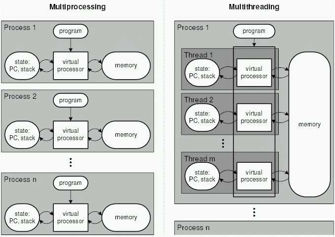

# 비동기/논블로킹

## 비동기/동기

* 동기
  * 호출한 함수가 작업 완료 여부를 확인
  * 타이밍을 위해 클럭을 사용
  * 파이프라인을 활용시 효율적
* 비동기
  * 호출된 함수가 작업 완료 여부를 확인
  * 이벤트나 다른 입력에 의해 트리거 되어 사용
  * 독립적이거나 지연이 클 때 활용적 (약간의 오버헤드가 있으며 순서를 보장하지 않음)
  * 
    * 위 그림과 같이 한 프로그램에서 여러 스레드가 존재할수 있고 해당 스레드 끼리 Heap, Data 영역의 데이터를 고유해 IPC 가따로 필요 없다
    * 또한 컨텍스트 스위치 비용도 적다.
  * Async/await
    * 비동기 프로그래밍을 쉽게 작성하고 관리하게 도와주는 키워드이다
    * async
      * 비동기 메서드를 선인시 메서드 시그니처 앞이 붙는다.
      * async 가 붙은 메서드안에서만 await 키워드를 사용할 수 있다.
    * await
      * 비동기 작업이 완료시 까지 기다리는 역할을 한다
      * await를 사용하여 비동기 작업을 호출하고 해당 작업이 완료 시 까지 메서드의 실행을 일시 중지시키고, 해당 작업이 완료 시 결과를 반환하고 메서드의 실행을 이어간다.

## 블로킹/논블로킹

* 블로킹
  * 호출 된 함수가 제어권을 가짐
* 논블로킹
  * 호출한 함수가 제어권을 가짐

작업이 완료될때까지 기자려야하는가 아닌가의 여부
