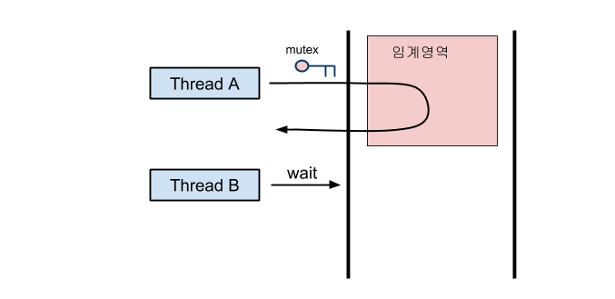

# 상호 배제 (뮤텍스, 세마포어, 모니터)

멀티프로그래밍에서 공유가 불가능한 자원의 동시사용을 피하기 위해 사용되는 알고리즘, 임계구역으로 불리는 코드영역에 의해 구현된다

즉, **하나의 프로세스가 공유자원을 이용할 때 다른 스레드나 프로세스의 접근을 제한하는것이다**

* 상호배제는 교창상태의 4가지 필요조건 중 하나이다.
  * 상호배제 : 베타적 통제권(동시 사용 불가)
  * 점유 대기 : 할당된 자원을 가진 상태에서 다른 자원을 기다림
  * 비선점 : 자원을 뺏을 수 없음
  * 순환 대기 : 각 프로세스는 순환적으로 다음 프로세스가 요구하는 자원을 갖고 있음
* **교착상태** 와 **기아 상태**가 발생 가능하다
  * 교착상태 : 무한대기 (dead lock)
  * 기아 상태 : 우선순위가 낮아 자원을 계속 할당받지 못함 (Starva)
* 멀티 프로세스나 멀티 스레드 동기화에 사용된다

## 임계영역 (Critical Section)

공유자원에 접근하는 프로세스 내부의 코드영역으로 어떤 프로세스가 이 영역을 수행 중일 때 다른 프로세스가 같은 영역을 수행한다면 문제가 발생된다.

따라서, 문제가 발생하지 않도록 한번에 하나의 프로세스만 이용하게 끔 보장해야하는 영역이다

임계영역의 문제를 해결하기 위해서는 3개의 조건을 충족해야한다.

* 상호배제
  * 하나의 프로세스가 임계영역에 들어가 있다면 다른 프로세스로는 접근이 안되어야한다.
* 진행
  * 임계영역에 들어간 프로세스가 없는 상태에서 들어가려는 프로세스가 여러개라면 어떤것을 들어갈지 결정해야한다
* 한정대기
  * 다른 프로세스의 기아를 방지하기 위해, 한번 임계영역에 들어간 프로세스는 다음 임계영역에 진입 시 제한을 두어야한다

임계영역의 동시 접근을 해결하기 위한 방법으로는 **lock, semaphore, monitor**등이 있다

## 뮤텍스(Mutex, 상호배제) Mutual Exclusion

* 스레드 간의 동기화에 사용된다
* 공유된 자원의 데이터를 여러 스레드가 접근하는것을 막는다.
* 임계영역을 가진 스레드의 Running Time 이 겹치지않게 단독적으로 실행하게 되는것
  * 임계구역의 하나의 스레드만 접근가능
  * 상태가 0,1로 이진 세마포어라고 부르기도한다.
* 다중 프로세스들의 공유리소스에 대한 접근 조율을 위해 Locking 과 UnLocking을 사용
  * 임계영역 진입 시 lock 나올땐 unlock

## 세마포어 (Semaphore)

* 뮤텍스가 임계영역에 들어가는 스레드가 하나라면, 세마포어는 복수개가 가능하다
* wait 와 signal을 통해 구현된다
  * wait가 먼저 호출되어 임계영역에 들어갈 수 있는지 확인 or 먼저 실행되어야하는 프로세스가 실행되는지 확인
  * 조건이 만족 시 wait를 빠져나와 임계영역으로 진입한다
  * 이후 signal이 호출된어 임계영역에 빠져나왔음을 알린다

### 뮤텍스와 세마포어의 차이

프로세스가 자원에 들어갈 때 뮤텍스는 방에 들어가기 위한 열쇠의 갯수이며, 세마포어는 빈방의 열쇠의 갯수 이다.

즉, 뮤텍스는 한 사람이 빈 방에 대한 열쇠를 가지고 있어서 방에 들어간다면, 그 사람이 나와야 다른사람이 열쇠를 건네받아 방을 들어갈 수있다.

반면 세마포어는 방이 네개면 열쇠도 네게일 것이고 한 사람이 들어갈 때마다 들어갈 수 있는 방은 하나씩 줄어들어 0개가 되면 빈방이 나올때까지 대기해야하는 상황이다, 아무나 먼저 나와야만 방과 열쇠를 한개 씩 얻어서 들어갈 수있다.

* 세마포어는 자원의 상태를 나타내는 일정의 '변수'로써 소유의 개념이 아니지만, 뮤텍스는 자원을 점유한 프로세스나 쓰레드가 잠시 소유하였다가 작업이 끝나면 반환하는 개념이다.
* 세마포어늬 바이너리 값을 갖는게 뮤텍스이다
* 세마포어는 뮤텍스가 될 수 있지만 뮤텍스는 세마포어가 될 수 없다
* 세마포어는 시스템 범위에 걸쳐 있고 파일 시스템상의 파일 형태로 존재, 반면 뮤텍스는 프로세스 범위를 가지고, 프로그램이 종료될때 지워진다
* 세마포어는 동기화 대상이 여러개 일때, 뮤텍스는 동기화 대상이 오로지 하나일 때 사용된다.

## 모니터(Monitor)

* 하나의 프로세스 내의 다른 스레드간 동기화에 사용된다
* 동기화 작업이 캡슐화되어 키워드를 통해 편하게 도이고하를 이용한다
* 세미노펑와 달리 wait, signal 설정 없이 함수앞에 synchronized를 붙여주면 상호배제하여 함수의작업이 수행된다

### 뮤텍스와 모니터의 차이

뮤텍스는 다른 프로세스간에 동기화 시 사용이 가능하고, 모니터는 하나의 프로세스 내에서 다른 스레드간의 동기화에 사용된다.
