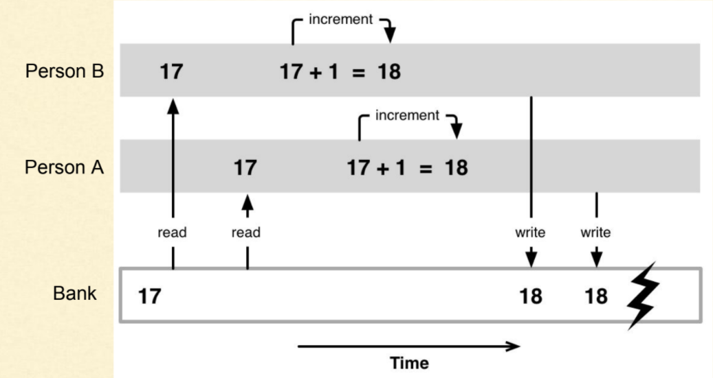
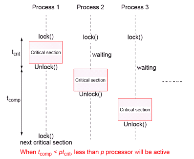

# 스레드의 동기화

## 필요성

스레드가 공유 변수에 접근시 경쟁조건 발생.



위와 같이 각기 다른 스레드에서 동시에 접근 read/write 시 충돌이 발생 이를 해결하기위해 **접근을 못하게 막는(lock)** 이다.



락을 잘못 사용시 **교착상태**가 발생할수 있으니 조심해야한다.

## 스레드 안전

여러스레드가 동시 실행될 때 코드가 동삭시 문제 발생하지 않을시 *스레드 안전 하다고 한다.*

다음 같은 경우를 알아보면 된다.

* 전역변수, 힙, 파일등 프로그램 전체에서 사용되는 데이터 동시 접근
* 핸들/ 콜백 또는 포인터로 간접적 접근
* 전역 범위의 리소스 할당, 재할당, 해제

스레드 안전을 달성 하기해 사용하는방법

* 공유상태를 피하는 방법
  * 재진입성 : 함수가 한 스레드에 의해 호출되어 실행 중일 때, 다른 스레드가 그 함수를 호출 하더라도 각 결과가 올바르게 반환되어야함.
  * 스레드 지역 저장소 : 변수를 각 스레드가 고유한 복사본을 갖도록 복사
  * 불변객체 : 만들어지고 변경할 수 없기 떄문에 동시에 읽기만 가능, 변경이 필요한 경우 새로운 객체를 만드는 형식
* 공유상태를 피하지 못할 떄
  * 상호 배제 : 하나의 스레드만 공유데이터를 읽고 쓸수 있도록 직렬화
  * 원자 연산 : 다른 스레드에서 중단될수 없는 원자성 작업을 이용, 다른스레드가 접근하는 방식과 상관없이 유효함을 달성.

### 스핀락

lock 상태에 접근시 lock이 풀릴떄까지 반복적으로 확인하고 풀리면 접근하는 방식

유저스페이스에만 동작하기에 컨텍스트 스위칭 배용이 없다. 다른 프로세스와 공유, **오래 대기시 문제 발생 짧은 스레드에서 사용해야한다**

```csharp
using System;
using System.Threading;

class Program
{
    static SpinLock spinLock = new SpinLock(); // 스핀락 객체 생성

    static int sharedValue = 0; // 공유 자원

    static void Main()
    {
        // 여러 스레드를 생성하여 동시에 공유 자원에 접근하도록 설정
        Thread[] threads = new Thread[5];
        for (int i = 0; i < threads.Length; i++)
        {
            threads[i] = new Thread(IncrementSharedValue);
            threads[i].Start();
        }

        foreach (Thread thread in threads)
        {
            thread.Join();
        }

        Console.WriteLine("최종 공유 값: " + sharedValue);
    }

    static void IncrementSharedValue()
    {
        bool lockTaken = false;
        try
        {
            spinLock.Enter(ref lockTaken); // 스핀락 획득

            // 공유 자원에 대한 작업 수행
            for (int i = 0; i < 100000; i++)
            {
                sharedValue++;
            }
        }
        finally
        {
            if (lockTaken)
            {
                spinLock.Exit(); // 스핀락 반환
            }
        }
    }
}

```

### 뮤텍스

운영체제를 통해 락을 걸어 준다.

다른 락이 풀릴 떄까지 계속 확인하는게 아닌 대기하는 상태가 된다.

**커널을 거치기 떄문에 컨텍스트 스위칭 비용은 존재한다**

```csharp
ㅇ``using System;
using System.Threading;

class Program
{
    static Mutex mutex = new Mutex(); // 뮤텍스 객체 생성

    static void Main()
    {
        // 여러 스레드를 생성하여 동시에 WriteLine 메서드 호출
        Thread[] threads = new Thread[5];
        for (int i = 0; i < threads.Length; i++)
        {
            threads[i] = new Thread(WriteToConsole);
            threads[i].Start();
        }

        foreach (Thread thread in threads)
        {
            thread.Join();
        }
    }

    static void WriteToConsole()
    {
        mutex.WaitOne(); // 뮤텍스 획득
        Thread.sleep(1000);
        // 안전하게 WriteLine 메서드 호출
        Console.WriteLine("스레드 ID: " + Thread.CurrentThread.ManagedThreadId + "가 WriteLine을 실행합니다.");

        mutex.ReleaseMutex(); // 뮤텍스 반환
    }
}

```

### 세마포어

배열처럼 여러 값에 접근할 떄 사용한다. 배열을 이용해 스레드를 관리한다

```csharp
using System;
using System.Threading;

class Program
{
    static Semaphore semaphore = new Semaphore(2, 2); // 세마포어 객체 생성 (초기 카운트: 2, 최대 카운트: 2)

    static void Main()
    {
        // 여러 스레드를 생성하여 동시에 작업 수행
        Thread[] threads = new Thread[5];
        for (int i = 0; i < threads.Length; i++)
        {
            threads[i] = new Thread(DoWork);
            threads[i].Start(i);
        }

        foreach (Thread thread in threads)
        {
            thread.Join();
        }
    }

    static void DoWork(object id)
    {
        Console.WriteLine("스레드 ID: " + id + "가 작업을 시작합니다.");

        semaphore.WaitOne(); // 세마포어 획득

        Console.WriteLine("스레드 ID: " + id + "가 작업을 수행 중입니다.");
        Thread.Sleep(2000); // 작업을 2초 동안 수행

        Console.WriteLine("스레드 ID: " + id + "가 작업을 완료했습니다.");

        semaphore.Release(); // 세마포어 반환
    }
}

```
