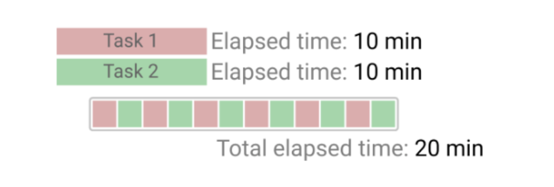
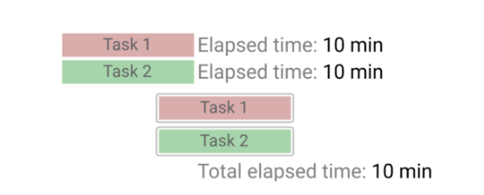

# 코루틴(Coroutine)이란

코루틴은 **경량 스레드** 이다.

코루틴은 스레드에서 실행된다. 코루틴은 단독으로 또는 다른 수단에 의해 실행은 될 수없다, 여러개의 코루틴을 하나의 스레드를 지정하여 실행할 수 있지만 동시에 실행하는 것은 불가능하고, 한번에 하나의 명령만 실행할 수 있다. 그 이유는 코루틴은 스레드내에서 실행되고 중단지점에 도달하자마 스레드를 떠나 대기중인 다른 코루틴을 선택할 수 있도록 해방되기 때문이다. 이렇게 하면 **스레드와 메모리 사용량이 줄어들어 많은 동시성 작업을 수행** 할수 있다.

코루틴은 스택이 없다는 것을 의미한다. 또한 스레드에 종속되지도 않는다. 그렇기에 Context Switching이 발생하지 않는다. 이러한 이유로 수천개의 스레드를 생성하는것보다 수천개의 코루틴을 생성하는것이 빠르고 자원을 적게 사용된다.

코루틴함수실행시 suspend 혹은 yield에 의해 함수가 호출된 부분에 값이 반환되고 이후 다시 코루틴 함수를 호출하면 코루틴 내부에 녀네둥 혹은 yield 지점 이후 코드로 돌아와서 실행을 하게된다.

## 동시성과 병렬성

* 동시성

동시에 여러작업을 수행하는것을 말한다, 하지만 눈으로 볼때 동시에 실행되는것이지, 사실 *시분할* 기법을 활용하여 조금씩 나누어 번갈아가며 실행하는것이다
[[1.Thread_기본]]

* 병렬성

여러 작업을 한 번에 동시에 수행하는것이다 CPU코어는 할일 1개만하지만 CPU 코어가 여러개일때 각 코어가 일을 동시에 실행하는것을 의미한다

Thread와 Coroutine은 모두 *동시성 프로그래밍*을 위한 기술이다

## Thread vs Coroutine

### 개요

* 스레드는 각 태스크에 해당하는 스택 메모리를 할당 받는다. 그리고 여러작업을 동시에 수행해야 할 때 OS는 어떤 스레드 작업을 먼저 수행할지, 어떤 스레드를 더 많이 수행해야 효율적인지에대한 스케줄링(선점 스케줄링)을 해야한다
* 코루틴은 작업 하나하나를 효율적으로 분배해서 동시성을 보장하는것을 목표로 하지만, 작업 하나하나에 Thread를 할당하는 것이 아닌 Object를 할당하고 이 Object를 자유롭게 스위칭함으로써 Context Switching 비용을 줄인것이다

### Thread

* 작업 하나하나의 단위
  * 각 Thread가 독립적인 Stack 메모리 영역을 가짐
* 동시성 보장 수단
  * 운영체제 커널에 의한 Context Switching을 통해 동시성 보장
  * 블로킹
    * Thread A가 Thread B의 결과가 나오기까지 기다려야 한다면, Thread A는 블로킹되어 Thread B의 결과가 나올때 까지 자원을 못쓴다.

Thread A에서 Task1을 수행하다 Task2의 결과가 필요할 때 비동기적으로 Thread B를 호출하게 된다. 이 때 Thread A는 블로킹되고 Thread B로 Context Switching이 일어나 Task2를 수행한다. Task 2가 완료되면 다시 Thread A로 Context Switching이 일어나고 결과 값을 Task1에 반환한다

동시에 같이 수행할 Task3, Task4는 각 Thread C, D에 할당되고 총체적으로 커널에서 선점 스케줄링을 통해 각 테스크를 얼마나 수행할지, 혹은 무엇을 먼저 수행할 지를 결정하며 알맞게 동시성을 보장한다

### Coroutine

* 작업 하나하나의 단위 : Object
  * 여러 작업 각각에 Object를 할당함
  * Coroutine Object도 객체이기 때문에 Heap에 적재된다
* 동시성 보장수단
  * 프로그래머의 코드를 통해 Switching 시점을 자유롭게 정함 (OS 관여 X)
  * Suspend
    * Object1 이 Object2의 결과가 나오기까지 기다려야한다면, Object 1은 Suspend 되지만 Object 1을 수행하던 THread는 유효하기 때문에 동일한 스레드에서 실행된다

작업 단위는 **Coroutine Object** 이므로, **Task 1 을 수행**하다가 **비동기 작업 Task 2 가 발생**하더라도, **Context Switching 없이**  **같은 Thread 에서 Task 2 를 수행할 수 있고** , 맨 오른쪽 경우처럼 **하나의 Thread 에서 여러 Coroutine Object 들을 같이 수행**할 수도 있다. **한 쓰레드에서 다수의 Coroutine 을 수행**할 수 있고, **Context Switching 이 필요없는 특성**에 따라 **Coroutine 을 Light-weight Thread 라고 부르는 것**이다.

그런데 위 경우를 다시 보자. **Thread A 와 C 가 동시에 수행되는 모습**이다. 이러면 결국 **동시성 보장을 위해서 Context Switching 이 필요한 경우**다. 따라서, **Coroutine 의 'No-Context Switching' 장점**을 극강으로 끌어올리기 위해, **단일 Thread 에서 여러 Coroutine Object 를 컨트롤하는 것이 좋다**
