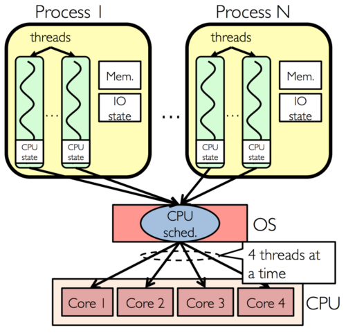
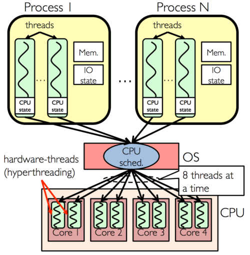

# 프로세서

* 물리 : CPU 에 들어간 실제코어
* 논리 : 작업 부하를 공유하며 동시에 스케줄링
* 하이퍼 스레딩 기술을 이용 컨텍스트 스위칭과 유후시간을 줄인다.
* 하이퍼 스레딩이 없는 CPU 작업
  * 
* 하이퍼 스레딩이 있는 CPU 작업
  * 
* 하이퍼 스레딩
  * 하나의 물리적 처리 장치를 두개의 논리적 처리장치로 만든다.
  * 두 개의 다른 Core로 보이도록 속임수
  * 두 작업을 전화하며 작업하지만 실제로는 한번에 하나씩
  * 논리적으로 나누어도 하이퍼 스레딩이 있는 CPU 가 그렇지 않은 CPU 보다 성능 우수
* 여러 프로세서가 공유된 메모리를 사용하는 **SMP(대칭형 다중처리)** 와 로컬 메모리와 외부 메모리를 구분해 사용하는 **MUMA(불균일 기억장치 접근)** 가 있다.
  * SMP
    * 두 개 이상의 프로세서가 단일 공유 *주 메모리* 에 연결되어 모든 입력 및출력 장치에 대한 전체 엑세스권한을 가지며 제어되는 다중 프로세서 컴퓨터 하드웨어 아키텍처
  * MUMA
    * 메모리 엑세스 시간이 프로세서와 관련된 메모리 위치에 따라 달라지는 다중 처리에 사용되는 컴퓨터 메모리 설계
    * 프로세서는 로컬이 아닌 메모리보다 빠르게 자체 로컬 메모리에 엑세스 할수 있따.
