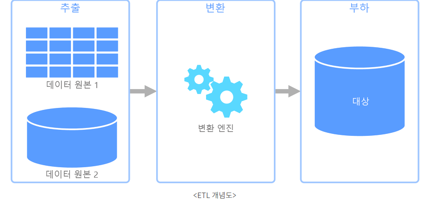

# ETL 이란

ETL은 여러 소스의 데이터를 일관된 단일 데이터 세트로 결합하여 데이터 웨어 하우스, 데이터 레이크 또는 기타 대상 시스템에 로드하는 오랫동안 사용된 데이터 통합 프로세스이다.

ETL은 데이터 분석 및 머신러닝 웨크 스트림을 위한 기반을 제공한다, ETL은 비지니스 규칙을 통해 월별 보고와 같은 특정 비지니스 인텔리전스 요구사항을 해결하는 방식으로 데이터를 정리하고 구성 할 뿐만 아니라 백엔드 프로세스 또는 최종 사용자 경험을 개선할 수 있는 분석 작업을 처리한다. ETL은 다음과 같은 목적으로 자주 사용된다

* 레거시 시스템에서 데이터추출
* 데이터를 정리하여 데이터 품질 개선 및 일관선 확립
* 대상 데이터베이스에 데이터 로드.

일반적으로 발생하는 데이터 변환에는 필터링, 정렬, 집계, 데이터 조인, 데이터 정리, 중복 제거 및 데이터 유효성 검사등의 다양한 작업이 포함된다.

# ETL 작동방식

* 추출
  * 데이터를 추출하는동안 원시데이터는 소스위치에서 스테이징 영역으로 복사되거나 보내진다.
    * SQL 또는 NoSql 서버
    * CRM 및 ERP 시스템
    * 플랫 파일
    * 이메일
    * 웹페이지
* 변환
  * 스테이징 영역에서 원시 데이터는 데이터 처리를 거치는데 여기서 데이터는 의도한 분석 사용 사례에 맞게 변환 및 통합된다
    * 데이터를 필터링, 정제, 중복제거, 유효성 검사 및 인증
    * 원시데이터 기반의 계산, 번역 또는 요약을 수행
    * 데이터 품질 및 규정 준수를 보장하기위한 감사 수행
    * 업계 또는 정부 규제에서 관리되는 데이터를 제거, 암호화 또는 보호한다.
* 로드
  * 변환된 데이터를 스테이징 영역에서 대상 데이터 웨어 하우스로 이동한다,

# ETL의 이점과 과제

데이터를 기타 저장소에 로드 전에 데이터 정제를 수행하여 품질을 개선한다. 시간이 많이 소요되는 배치작업인 ETL은 업데이트 빈도가 낮은 소규모의 대상 데이터 저장소 생성에 권장된다. 반면 ELT(추출,로드,변환),, 변경 데이터 캡쳐(CDC)및 데이터 가상화를 비롯한 데이터 통합 방법은 점점 증가하는 변경 데이터 또는 실시간 데이터 스트림을 통합되는데 사용된다.
