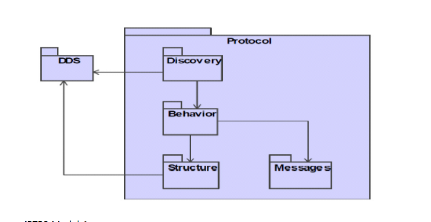
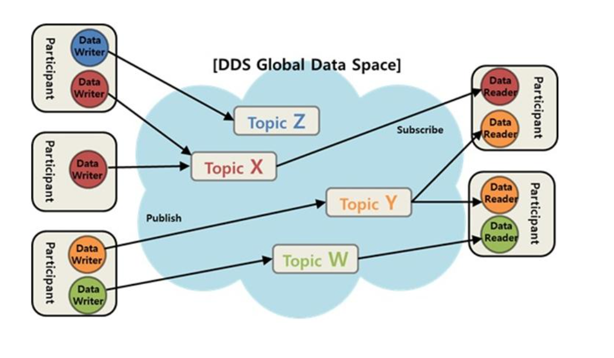

# DDS 기술개요

## DDS DCPS

Data Publisher/Subscriber (DCPS)는 응용프로그램에서 제공되는 데이터를 발간/구독 기능 인터페이스이다. 이 계층을 통해 응용프로그램은 데이터를 교환할 상대에 대한 인지 없이 원하는 데이터의 발간/구독만을 수행하게된다. DSPS는 read(), write() 방식의 API를 제공하여 읽기/쓰기 방식으로 응용프로그램 간의 데이터 교환기능을 제공한다.

전송 데이터에 대한 값 설정 및 설정된 데이터를 퍼블리싱하는 기능을 제공하고, 구독하는 App에서의 수신등록했던 관심 항목에 대한 데이털르 수신하여 수신된 데이터에 대한 값의 접근을 가능하게 한다. 또한 토픽의 정의, 토픽 타입정의. Publisher, Subscriber Entity 생성, 각 Emtity에 대한 Qos 설정 및 모든 Entity를 운용하게 한다.

### Publisher/ DataWriter

Publisher과 DataWriter은 전송 측에 존재한다.

Publisher은 데이터 분산을 담당, 다양한 형태의 타입(Topic)으로 정의된 데이터를 출간한다, Publisher에는 출간할 Topic의 종류에 따라 다수의 DataWriter을 소유할 수 있으며 DataWriter은 정해진 하나의 데이터 타입에 맞는 토픽에 값을 할당한다

### Subscriber/ DataReader

Subscriber/ DataReader은 수신 측에 존재한다.

Subscriber은 출판 데이터 수신 및 수신데이터를 에플리케이션이 이용할 수 있도록 한다, 애플리케이션은 수신된 토픽에 대해 DataReader을 사용하여 접근.

## DDS RTPS

Real Time Publisher/Subscribe(RTPS)는 OMG에 표준화된 데이터 중심 배포 서비스를 위한 데이터 전송 프로토콜로써 발간/구독 통신모델을 지원하며 UDP/IP와 같이 신뢰성 없는 전송 계층 위세서도 동작 가능하도록 설계되었다.

RTPS를 구성하는 기본 모듈은 아리와 같이 4가지로 나타낼 수 있다.

### Structure Module

RTPS 표준 규격 상 데이터 교환 시 통신에 참여하게 되는 개체들에 대해 정의

### Message Module

Writer 과 Reader간에 정보 교환을 위해 사용될 메시지에 대한 정

### Behavior Module 

RTPS의 Writer 와 Reader들 간 상태적, 시간적 조건에 따라 수행되어야 할 메시지

### Discovery Module

도메인 상에 존재한는 데이터 배포 관련 개체에 대한 정보를 탐색하는 기능을 수행한다.

두가지 정의된 프로토콜을 사용

* PDP (Participant Discovery Protocol) : 서로 다른 네트워크 상에서의 Participant 탐색을 위한 프로토콜
* EDP (Endpoint Discovery Protocol) : Writer, Reader와 같이 서로 다른 종단점 간의 탐색 정보 교환에 사용되는 프로토콜

## 발간/ 구독의 기본 구성요소

DDS 미들웨어는 Data중심의 분산처리를 위해 발간/구독 방식을 취한다 이를 통해 이종 플랫폼 및 언어 그리고 다양하게 요구되는 Qos를 가지는 응용프로그램들에 독립적이고 확장성 있는 연결이 가능하다.

발간/구독 방식을 위해 DDS는 Topic 이라는 단위로 구별되는 데이터와 이를 전송하는 Publisher와 DataWriter, 수신하는 측의 Subscriber와 DataReader로 구성되어 있다.

### Topic

발간/구독의 관계를 정의하는 Key이다, Topic은 도메인 내에서 유일한 이름, 데이터타입, 그리고 데이터에 설정된 Qos를 갖는다, Publisher에서 어떤 Topic을 정의하여 발간하면 Subscriber는 자신의 관계된 Topic을 수신한다. 또한 그 데이터에 관계된 Qos를 Topic의 Qos에 추가하여 Topic과 연관된 DataWriter, DataReader에 연관된 Publisher의 Qos를 설정, Publisher의 행동을 제어한다, 이는 Subscriber에서도 마찬가지이다.

### Publisher

데이터를 분배하는 객체이다, 각 Publisher은 여러 Topic을 발간하여, 하나의 Publisher느 다수의 DataWriter를 가질 수 있따.

즉, 하나의 Publisher가 담당하는 데이터 타입의 개수만큼 DataWriter가 존재하며, DataWriter은 서로다른 타입의 데이터를 하나씩 담당한다, 프로그램에 전송하고자 하는 주어진 타입의 객체의 값을 연관한 Publisher에게 전달하는 역할을 한다, 발간하고자 하는 데이터 객체의 값이 Publisher에게 전해지면 Publisher은 자신에게 설정된 Qos값에 따라 Subscriber에게 전파

### Subscriber

발간된 데이터를 수신한다. Subscriber의 Qos에 따라 각각의 응용프로그램에서 데이터를 받아들인다. 수신된 데이터에 접근하려면 응용프로그램은 연관된 Topic으로 정의된 DataReader를 사용해야하며, Subscriber에 추가한다. 하나의 Subscriber은 다수의 DataReader과 연관될 수 있다. 따라서 Subscriber은 다수의 서로다른 Topic과 데이터 형을 수신이 가능
