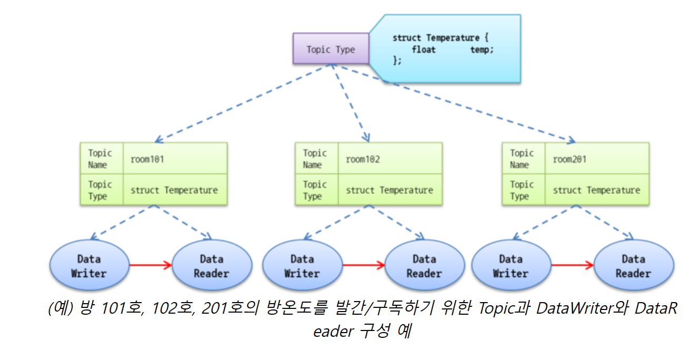
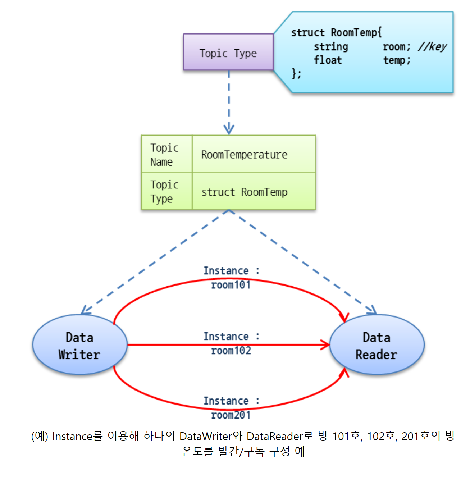

# Topic 과 Instance

**DDS에서 데이터를 표현하는 가장 기본적인 방법은 Topic이다**

Topic은 발간인과 구독자를 연결하는 기본정보로써 Topic Name과 Topic Type으로 구성된다. Topic Name은 도에인 내에서 Topic을 식별하기 위한 이름으로 string 형식의 유일한 값을 갖는다. Topic Type은 Topic의 실제 데이터를 정의한 것으로 Topic Name과 달리 여러 Topic이 동일한 Topic Type을 갖는다.

만약 Topic의 수가 중가 시 발간/구독을 위한 DataWriter과 DataReader의 수도 함께 증가된다. 이렇게 Topic이 증가함으로써 발생하는 DDS 미들웨어의 Overhead 발생을 예방하기 위해 DDS는 Instance라는 개념을 채용했다.

Instance는 하나의 DataWriter/Reader에서 여러개의 Instance를 발간/구독을 할 수 있게 해준다, 각 Instance는 Topic Type을 구성하는 하나 이상의 Data Element로 구성된 Key로 구별된다. Topic Type에 Key가 없는 경우, 해당 Topic Type을 갖는 토픽은 자체가 하나의 Instance가 되어 한 종류의 Instance만 발간/구독이 가능하다.

