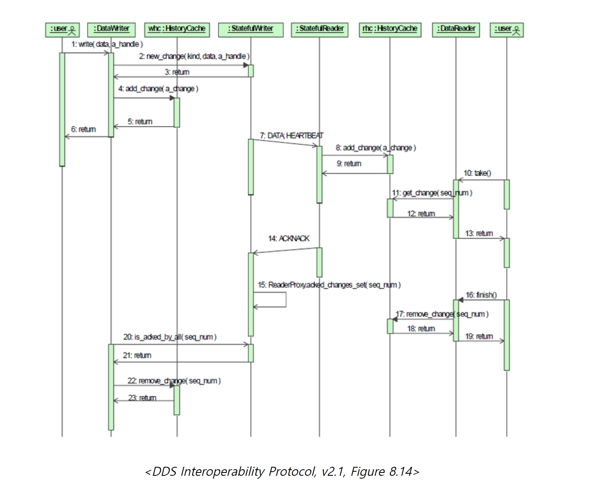

# RTPS Behavior

RTPS Writer과 매치된 RTSP Reader간의 일반적인 교환 과정은 밑 그림과 같다.

1. DDS 사용자는 DDS DataWrite의 write를 호출하여 데이터를 전송한다.
2. DDS DataWriter은 new_chage를 호출하며 RTPS Writer에 새로운 CacheChange을 생성 생성된 CacheChange는 유일한 SequenceNumber를 갖음으로써 다른 CacheChange와 식별이 가능하다.
3. new_change 오퍼레이션에서 리턴된다
4. DDS DataWriter는 add_chage 오퍼레이션을 사용 RTPS Writer의 HistoryCache에 CacheChange를 추가
5. add_chage 에서 리턴된다
6. write 메소드에서 리턴되며 사용자의 발간행동은 완료된다
7. RTSP Writer은 RTSP Reader에거 CacheChange change의 내용을 Data Submessage로 전송한다, heartbeat Submessage를 전송하여 aknowledgement를 요청
8. RTSP Reader는 Data message를 수신 add_chage 사용하여 reader의 HistoryCache에 수신한 CacheChage를 저장
9. add_change를 Return한다, CacheChange는 DDS DataReader와 DDS 사용자가 확인할 수 있따.
10. DDS 사용자는 DDS 규격에 있는 listener나 WaitSet 중 하나의 방법으로 데이터가 있음을 알게되고 DDS DataReader의 take 오퍼레이션을 호출하여 데이터를 읽을 준비를 한다
11. get_chage 메서드를 이용해 DataReader에 CacheChange를 리턴
12. HistoryCache 에서 DataReader에거 리턴
13. take 함수는 data를 사용자에게 리턴한다
14. RTSP Reader은 CacheChage가 Reader의 HistoryCache에 저장되었다는 의미의 ASK 메세지를 전송한다 (GUID와 SequneceNumber 포함)
15. RTSP Reader가 CacheChange를 수신했음을 기록하고, acked_changeds_set 메서드를 사용하여 ReaderProxy가 유지하는 acked_changed의 set에 이를 추가한다.
16. DDS는 take 오퍼레이션으로 데이터를 갖고 가서 더 이상 사용하지 않을거라는 의미로 DataReader에 finish 호출
17. DDS Reader 사용자는 HistoryCache에서 데이터를 제거하기위해 remove_chage 호출
18. reomve_chage 에서 리턴된다
19. finish 요청에서 리턴된다
20. DDS DataWriter은 StatefulWriter와 매치된 모든 RTPS Reader endpoints가 CacheChages를 수신했는지 확인하기위해 is_asked_by_all 을 호출한다
21. is_asked_by_all 에서 리턴되며 특정 sequenceNumber의 모든 chage가 모든 RTPS Readerendpoints에서 인지했음을 알려준다
22. DDS DataWriter은 RTPS Writer의 HistoryCache에서 SequnceNumber에 해당하는 chage를 제거하기위해 remove_change를 호출한다
23. remove_change에서 리턴된다
