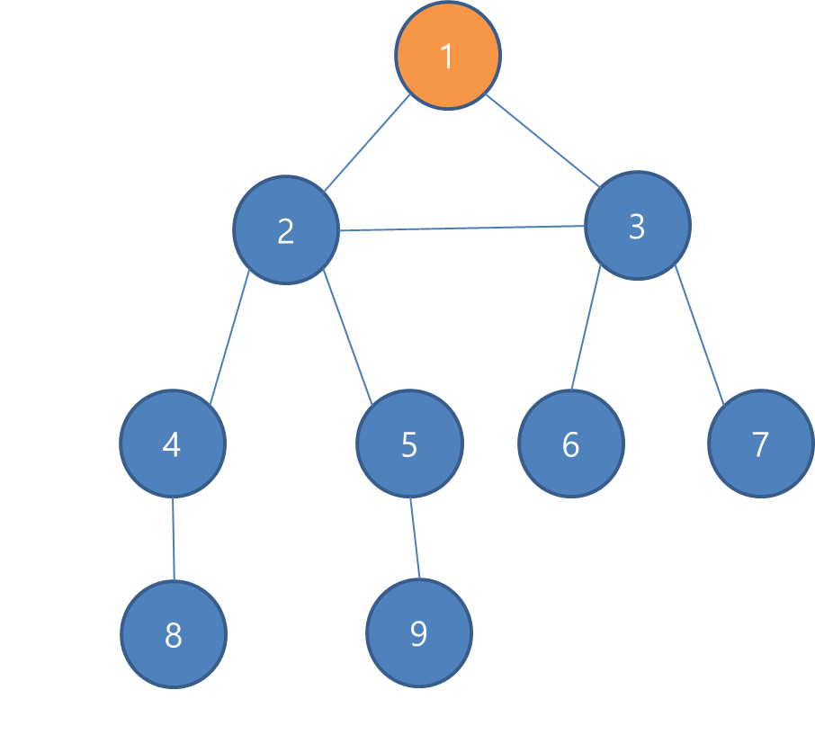

# 깊이 우선 탐색 DFS
stack이나 재귀함수를 이용해서 구현한다.  
DFS 와 BFS 는 탐색을 할 때 사용된다.

그래프 노드는 아래와 같다.

1. 1을 스택에 쌓는다 (스택 : 1
2. 1과 인접한 2를 쌓는다 (스택 : 1 2
3. 2와 3이 연결되어 있으므로 3을 쌓는다( 스택 : 1 2 3
4. 3과 인접한 6 을 쌓는다 (스택 : 1 2 3 6
5. 인접한 노드가 없기 떄문에 6을 뺀다 스택 : 1 2 3
6. 3과 인접한 노드중 방문하지 않은 7을 스택에 쌓는다 (스택 : 1 2 3 7
7. 인접한 노드가 없기 떄문에 7을 뺀다 스택 : 1 2 3
8. 인접한 노드가 없기 떄문에 3을 뺀다 스택 : 1 2
9. 2과 인접한 4 을 쌓는다 (스택 : 1 2 4
10 4과 인접한 8 을 쌓는다 (스택 : 1 2 4 8 
11. 인접한 노드가 없기 떄문에 8을 뺀다 (스택 : 1 2 4
12. 인접한 노드가 없기 떄문에 4을 뺀다 (스택 : 1 2 
13. 2과 인접한 노드중 방문하지 않은 5을 스택에 쌓는다 (스택 : 1 2 5
14. 5과 인접한 9 을 쌓는다 (스택 : 1 2 5 9
15. 인접한 노드가 없기 떄문에 9을 뺀다 (스택 : 1 2 5
16. 인접한 노드가 없기 떄문에 5을 뺀다 (스택 : 1 2 
17. 인접한 노드가 없기 떄문에 2을 뺀다 (스택 : 1 
18. 인접한 노드가 없기 떄문에 1을 뺀다 (스택 : 
19. 탐색순서 1-2-3-6-7-4-8-5-9

코드구현
```c++
#include <iostream>
#include <vector>

using namespace std;

int number = 9;
int visit[9];
vector<int> a[10];

void dfs(int start){
    if(visit[start]){
        // 방문한경우 바로 빠져나옴 
        return;
    }
    
    visit[start] = true; // 방문
    printf("%d ", start);
    
    for(int i=0; i< a[start].size(); i++){
        // 인접한 노드를 방문 
        int x = a[start][i];
        dfs(x);
    }
}

int main(void){
    // 1과 2를 연결 
    a[1].push_back(2);
    a[2].push_back(1);
    
    // 1과 3을 연결 
    a[1].push_back(3);
    a[3].push_back(1);
    
    // 2과 3을 연결 
    a[2].push_back(3);
    a[3].push_back(2);
    
    // 2와 4를 연결 
    a[2].push_back(4);
    a[4].push_back(2);

    // 2와 5를 연결 
    a[2].push_back(5);
    a[5].push_back(2);
    
    // 4와 8을 연결 
    a[4].push_back(8);
    a[8].push_back(4);
    
    // 5와 9를 연결 
    a[5].push_back(9);
    a[9].push_back(5);
    
    // 3과 6을 연결 
    a[3].push_back(6);
    a[6].push_back(3);
    
    // 3과 7을 연결 
    a[3].push_back(7);
    a[7].push_back(3);
    
    // 1번 노드부터 bfs 탐색 실행 
    dfs(1);
    
    return 0;
} 
```