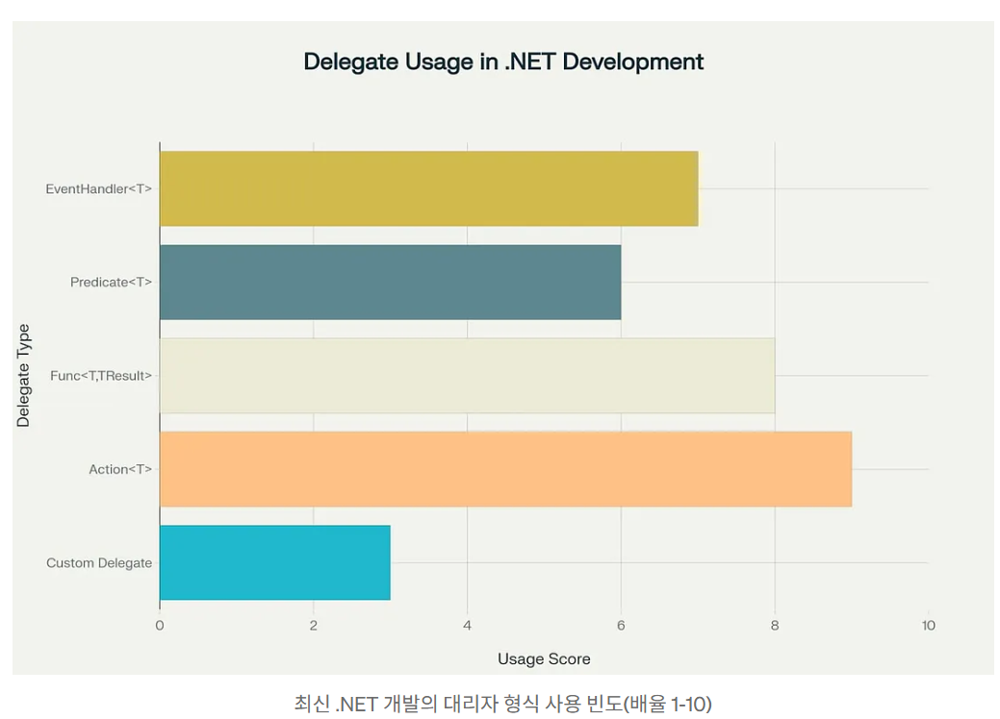

## 대리자 계층 이해

NET의 대리자는메서드에 대한 원격 컨트롤과 같다, 마치 변수인 것 처럼 함수를 전달하고 트리거 할 수있으므로 나중에 어떤 메서드가 실행되는지 결정할 수 있는 권한을 제공한다.

### Delegate Type 에코 시스템

현제 Net에서는 서로다른 용도로 사용되는 여러가지 기본 대리자를 제공하며 각 대리자는 사용사례와 특성이 있다.



위 그림에서 볼 수 있듯 대리자는 단순성과 다양성으로 인해 C# 개발을 이끈다, 사용자 지정 디리자는 강력하지만 NET2.0의 Generic 도입으로 잘 사용되지 않는다.


## Types of Delegates 심층 분석

각 대리자를 사용해야 하는 경우를 이해하기 위해 다양한 유형의 대리자를 더 자세히 살펴보겠습니다.

* 사용자 지정 대리자사용자 지정 대리자는 메서드 서명을 정확하게 제어할 수 있으며 특수한 콜백 시나리오에 적합합니다. 키워드를 사용하여 선언되며 필요한 모든 매개 변수 및 반환 형식 조합을 포함할 수 있습니다.`delegate`

```csharp
public delegate decimal TaxCalculationDelegate(decimal amount, string region);
public delegate bool ValidationDelegate<T>(T item);
```

사용자 지정 대리자는 기본 제공 대리자가 특정 요구 사항과 일치하지 않거나 API를 보다 자체 문서화하려는 경우에 사용해야 합니다.

* 일반 기본 제공 대리자: .NET Framework에서는 대부분의 사용 사례를 다루는 세 가지 기본 제네릭 대리자 형식을 제공합니다.- Action`<T>` 대리자: 대리자는 값(void)을 반환하지 않고 최대 16개의 매개변수를 사용할 수 있는 메서드를 나타냅니다. 결과 없이 작업을 수행하는 작업에 적합합니다. 이러한 대리자는 이벤트 처리기, 로깅 작업 및 모든 void 반환 메서드에 적합합니다.`Action<T>`

```csharp
Action simpleAction = () => Console.WriteLine("Hello!");
Action<string> logMessage = msg => Console.WriteLine(msg);
Action<int, string> processItem = (id, name) => Database.Save(id, name);
```

- Func<T, TResult> 대리자: 대리자는 값을 반환하는 메서드를 나타내며 최대 16개의 입력 매개 변수를 사용할 수 있습니다. 매개 변수의 마지막 형식은 항상 반환 형식을 나타냅니다. Func 대리자는 LINQ 쿼리, 변환 및 계산된 결과가 필요한 모든 시나리오에서 빛을 발합니다.`Func<T, TResult>`

```csharp
Func<string> getCurrentTime = () => DateTime.Now.ToString();
Func<int, int, int> calculator = (x, y) => x + y;
Func<List<int>, int> findMax = numbers => numbers.Max();
```

- Predicate`<T>` 대리자: 대리자는 하나의 매개변수를 취하고 를 반환하는 메서드를 나타내는 특수 버전입니다. 필터링 및 유효성 검사 논리에 자주 사용됩니다. .NET Framework는 List`<T>`와 같은 컬렉션 클래스에서 및 와 같은 메서드에 대해 Predicate를 광범위하게 사용합니다.`Predicate<T>``Func<T, bool>``boolean``FindAll``RemoveAll`

```
Predicate<int> isEven = number => number % 2 == 0;
Predicate<string> isValidEmail = email => email.Contains("@");
```

## 멀티캐스트 대리자 및 오류 처리

NET의 모든 대리자는 멀티캐스트이므로 순차적으로 호출되는 여러 메서드에 대한 참조를 보유할 수 있습니다. 이 강력한 기능을 사용하면 이벤트 기반 프로그래밍을 수행할 수 있지만 예외를 신중하게 처리해야 합니다.

**멀티캐스트 대리자의
문제점**호출 목록의 대리자가 예외를 throw하면 전체 호출 체인이 중단됩니다. 이 동작은 특히 이벤트 기반 응용 프로그램에서 예기치 않은 결과를 초래할 수 있습니다.

```csharp
Action<string> loggers = message => Console.WriteLine($"Logger 1: {message}");
loggers += message => throw new Exception("Logger 2 failed!");
loggers += message => Console.WriteLine($"Logger 3: {message}"); //never executed if Logger 2 fails
```

이 문제를 해결하려면 개발자가 호출 목록을 수동으로 반복하고 각 대리자에 대한 예외를 처리해야 합니다. 이 패턴은 호출 목록의 모든 대리자가 일부 실패하더라도 호출되도록 합니다.

```csharp
foreach (Action<string> logger in loggers.GetInvocationList())
{
    try
    {
        logger("Log message");
    }
    catch (Exception ex)
    {
        //handle or log the exception without breaking the chain
        Console.WriteLine($"Logger failed: {ex.Message}");
    }
}
```

### NET의 이벤트 패턴

Net의  이벤트는 게시자-구독자 관계로 관찰자 패턴을 구현하기 위해 대리자를 기반으로 한다, 다양한 이벤트 패턴은 다양한 수준의 메모리 안전성, 복잡성 및 성능을 제공한다.

> NET의 이벤트는 대리자 위에 빌드된 알람 시스템과 같다. 프로그램의 한 부분이 다른 부분에 신호를 보내고 관심있는 청취자가 자신의 방식으로 응답하는 방법이다

* 메모리 누수 문제
  * NET의 표준 이벤트는 구독자가 제대로 취소하지 않을 때 메모리 누수를 일으킬 수 있다, 이는 게시자가 구독자에 대한 강력한 참조를 보유하며 가비지 수집을 방지하기 때문에 발생한다, 인스턴스가 더이상 필요하지 않지만 이벤트 구독을 취소하지 못하는 경우 존재하는 한 가비지 수집이 되지 않는다.
  * ```csharp
    public class Publisher
    {
        public event EventHandler DataChanged;

        public void RaiseEvent()
        {
            DataChanged?.Invoke(this, EventArgs.Empty);
        }
    }

    //subscriber with potential memory leak
    public class Subscriber
    {
        private Publisher _publisher;

        public Subscriber(Publisher publisher)
        {
            _publisher = publisher;
            _publisher.DataChanged += OnDataChanged; // Subscription creates reference
        }

        private void OnDataChanged(object sender, EventArgs e)
        {
            Console.WriteLine("Data changed!");
        }

        //missing: proper unsubscription in Dispose or finalizer
    }
    ```
* 약한 이벤트 패턴
  * 약한 이벤트 패턴은 구독자에 대한 약한 참조를 사용하여 메모리 누수 문제를 해결합니다. 이렇게 하면 가비지 수집기가 구독자 개체가 이벤트에 등록된 상태로 유지되더라도 해당 개체를 회수할 수 있습니다. 이 패턴은 수명이 긴 시스템에서 더 나은 메모리 안전성을 제공하는 동시에 이벤트 기반 아키텍처의 이점을 유지
  * ```csharp
    public class WeakEventManager
    {
        private readonly List<WeakReference> _subscribers = new();

        public void Subscribe(EventHandler handler)
        {
            _subscribers.Add(new WeakReference(handler));
        }

        public void Raise(object sender, EventArgs e)
        {
            for (int i = _subscribers.Count - 1; i >= 0; i--)
            {
                if (_subscribers[i].IsAlive)
                {
                    var handler = _subscribers[i].Target as EventHandler;
                    handler?.Invoke(sender, e);
                }
                else
                {
                    _subscribers.RemoveAt(i); //clean up dead references
                }
            }
        }
    }
    ```
