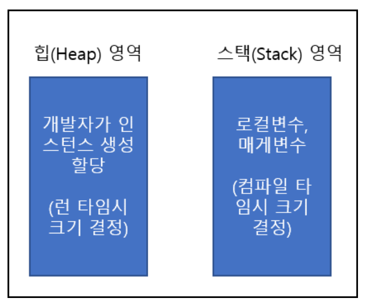

# SPAN

## Span 이란

모든 프로세스는 프로세스가 실행될 때 OS로부터 가상 메모리를 할당 받는데 닷넷의 가상메모리는 크게 Heap와 Stack영역으로 나누어진다



힙 영역은 관리 힙으로 불리며 객체가 인스턴스화 되는 프로세스의 전역공간이다

이러한 힙영역은 가비지 콜렉션의 관리대상이 되어 느리고 GC의 영향을 받는다

반면 Stack은 각 스레드마다 공간이 할당되고 힙영역보다 훨씬 빠르다

### Span `<T>`

Sapn `<T>` 구조체는 ref struct 타입의 구조체이다.

힙영역에 할당에 영향받는 박싱작업은 불가능하다.

Span `<T>` 은 힙영역이나 스택영역, stakalloc으로 할당한 비 관리 메모리 영역까지 공통으로 접근할 수있다.

```csharp
var buffer = new byte[10];
Span<byte> bytes = buffer;

Span<byte> slicedBytes = bytes.Slice(start: 5, length: 2);
slicedBytes[0] = 42;
slicedBytes[1] = 43;
bytes[2] = 44;
bytes[5] = 45;
```

메모리 참조형태의 View형식이기에 Span 에서 Slice로 일부값을 변경하면 원본의 객체에도 변경이 되고 마찬가지로 원본 객체의 값이 변경되도 Span에 반영된다.

## SPAN을 사용해야 하는 이유

### 잘 만들어진 배열

* 성능 상향
* 읽기전용 버전 (ReadOnlySpan)이 있다
* System.Array뿐 아니라 스택 벼열과 관리되지 않는 힙에서도 사용이 가능
* T 가 관리되지 않는 타입일 때, MemoryMarshal에 따라 타입을 넘기는 유연한 읽고 쓰기가 가능하다
* IList로 캐스팅 하지 않아도 인덱서를 사용가능

### No More Unsafe

System.Array, 스택배열, 관리되지 않는 힙이라는 세 종류의 배열이 존재한다

기존의 안전한 Context에서 사용하는것은 Array 뿐으로 다른 2개의 이용에는 unsafe가 필요하다. 3종의 배열은 모두 첫번째 요서에 다한 참조와 배열길이를 가지며, 내부적으로 메모리에 연속하고, 색인 사용이 가능하다는 추상화 할 것같은 공통된 기능을 가지지만, 포인터 없이는 실현이 불가능하다.

이러한 단점을 극복하기위해 Span이 구현되었다. 인터페이스타입과는 다르지만 "배열 타입" 으로 기대되는 행동을 추상화 되어 있다.

## Span을 사용하면 안되는 3개의 케이스

### 클래스의 맴버로 사용할 수 없다

Sapn은 ref struct 라는 타입이다. ref struct의 객체는 반드시 스택에 놓여 있다는것을 보증한다. 반복하면 힙에 실릴 수 있는것은 일절 할 수 없다는 것이다
