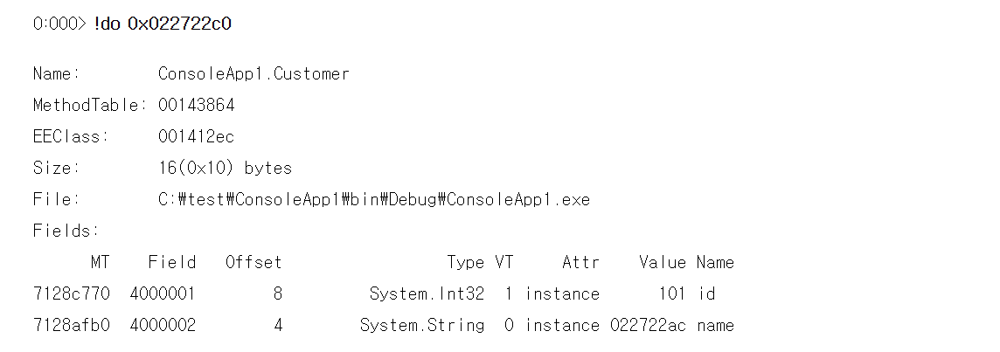
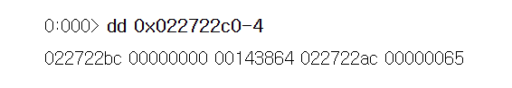
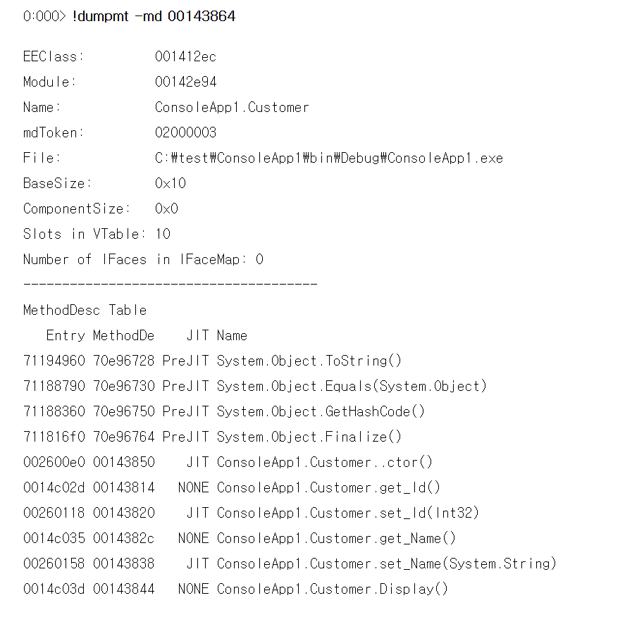
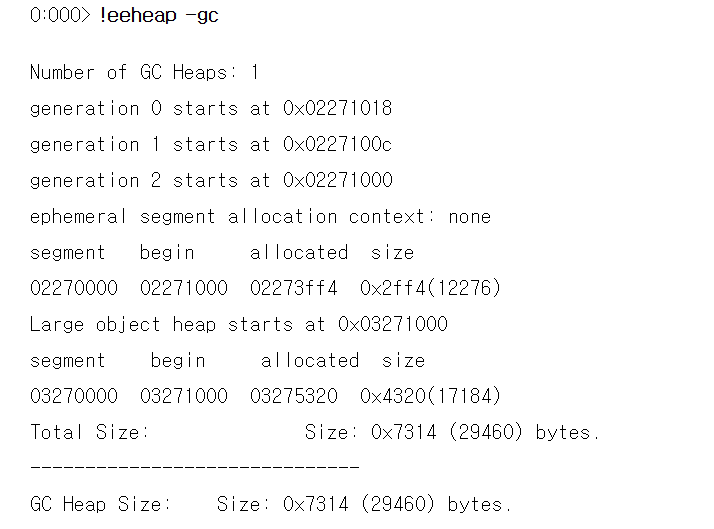
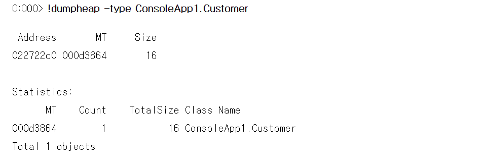

## C# 클래스 객체는 어떻게 Managed Heap에 표현되는가?

C# 에서 클래스 객체를 생성 시 이는 CLR Managed Heap에 생성이 된다, 이 아티클은 이러한 객체가 어떻게 Heap에서 표현이 되는지, 즉 객체가 Heap 메모리 공간에 어떤 형태로 저장되는지 살펴본다.

```csharp
using System;
namespace ConsoleApp1
{
    class Program
    {
        private static void Main(string[] args)
        {
            Customer c = new Customer();
            c.Id = 101;
            c.Name = "Lee";

            // 디버거 접속을 위한 대기
            Console.ReadLine();

            c.Display();
        }
    }

    public class Customer 
    {
        private int id;
        private string name;

        public int Id {
            get { return id; }
            set { id = value; }
        }
        public string Name {
            get { return name; }
            set { name = value; }
        }
        public void Display() {
            Console.WriteLine(id + name);
        }
    }
}
```

위 예제를 볼때 Custom 클래스 생성후, 이 객체거 Heap 상에 어떻게 존재하는지 보면 Main() 에서는 Customer 객체 C를 생성 후, 속성 값을 지정하고 대기한다.

Windbg 디버그로 디버깅 하기 위해 아래와 같은 명령을 실행 *C> windbg ConsoleApp1.exe* ReadLine() 에서 프로그램이 정지 시 *0:000> **!clrstack -a*** 를 이용하여 CallStack 및 로컬 변수, 파라미터를 확인한다.

Call Stack중 Main()함수에 있는 로컬 변수는 Customer 객체일 것이므로 위의 LOCALS에서 변수 0x004ef320 의 값인 Reference 포인터값 0x023722c0을 조사해 본다. SOS 의 !do 명령은 !dumpobj의 축약형으로 Reference Type 객체의 내용을 표시해 준다.



여기서 출력을 보면 클래스명이 네임스페이스를 포함한 클래스 명임을 알 수 있고, 객체사이즈는 16바이트 임을 알수 있다. Managed Heap 상의 레퍼런스 타입의 객체는 X86머신에서 다음과각ㅌ은 구조를 가진다

**Object Header(4byte) + Type Handle (4Byte) + 객체 필드들**

클래스 객체를 생성한다는 것은 새로운 객체 필드를 힙 메모리상에 만든다는 것이며, CLR Managed Heap 에서는 각 객체마다 Object Header과 Type Handle을 이들 객체 필드 앞에 추가로 갖는다, 객체는 Managed Heap 상에 클래스들의 값을 갖는 일련의 데이타 메모리 영역이며, 클래스의 메서드 코드는 클래스 인스턴스 즉 객체와 별도로 존재한다.

위 예제에서는 Customer 크랠스는 2개의 필드를 갖는데, 정수형 id 와 문자열 name 필드이다, id는 4바이트고, name은 문자열로 레퍼런스 객체이므로 다시 Heap 상에 System.String 객체를 만들고 객체 레퍼런스 포인터만을 저장하므로 4바이트를 차지한다. (만약 64 일시 8바이트) 따라서 객체 필드는 8바이트를 차지하고, 여기에 Header 과 Type Handle 크기를 더해 총 16 바이트의 객체 크기를 갖는 것이다, 만약 Customer 클래스로부터 10개의 객체를 생성한다면 16 * 10 160바이트를 Managed Heap에 할당하게 된다 또한, 만약 name 필드 문자열을 포함한 전체 객체 사이즈를 구하기 위해서는 !objsize 명령을 사용할 수있다.

클래스 객체 포인터는 항상 Type Handle을 가리킨다. 따라서 Object Header 를 보기 위해선느 아래와 같이 객체 포인터에서 4바이트를 빼서 출력해야 한다, Object Header는 상황에 따라 객체 해쉬값, Lock, Thunking, AppDomain 등 여러가지 정보를 가질 수 있는데,많은 객체가 이러한 정보를 필요로 하지않으므로 기본적으로 0을 할당한다. 객체가 Object Header을 사용하는 예를 보면 만약 코드에서 Object.GetHashCode()를 호출 시 Header는 해당 객체의 해쉬코드 값을 갖는다. 이런 상화 에 다시 lock이 사용되면 Sync Block 이라는 CLR의 시스템테이블 영역에 할당되고 이곳에 해쉬값 등 기존 데이타를 옮기고 locking 정보를 추가로 저장한 후 Object Header에 Sync Block Index 번호를 저장한다. 즉, 해당 객체 해더는 4바이트이므로 객체의 여러 다른 정보를 저장할 필요가 있는경우 CLR은 Sync Block 을 non GC 메모리에 자동 할당 후 여러정보를 이곳에 이동 복제한다.



(주: dd 는 display dword의 약자로 특정 메모리 주소로부터 dword 형식으로 메모리 내용을 출력)

한가지 주목할 점은 C# 클래스에서는 id가 name보다 먼저 위치하는데, !do의 필드 출력은 Offset을 보면 name은 offset 4, id는 8로 되어 있는 점이다. 이는 .NET 에서 메모리 효율성을 높이기 위해 필드의 위치를 내부적으로 변경하기 때문이다. 따라서 많은 경우 클래스 필드의 순서가 메모리 상에 바뀌어서 표현된다 (주: 이러한 디폴트 자동 레이아웃은 개발자가 LayoutKind.Explicit을 사용하여 특정 레이아웃으로 지정할 수 있다). 위의 메모리 내용은 Object Header는 0, TypeHandle은 00143864 , name 필드는 022722ac, id는 0x65 (101) 임을 나타낸다.

그러면 CLR은 어떻게 각 메모리 Offset에 위치한 필드 데이타를 해석하는 것일까? 이는 CLR이 Type (Reference 타입 혹은 Value 타입)에 대한 정보를 모두 갖고 있기 때문에 가능하다. 한 프로세스 내에서 사용되는 모든 Type들 각각에 대해 CLR은 Type 객체를 하나씩 만들어 가지고 있다. CLR은 프로세스 내에서 사용되는 각각의 Type에 대해 해당 프로세스 내에 반드시 1개의 Type객체를 생성하게 되며, 이 Type 객체는 고유한 Type Handle을 갖게 된다.

C# 프로그램에서 Type의 TypeHandle 속성을 호출 시 이 Type Handle 값을 얻을 수 있고, Type Handle 로부터 Type을 구하기 위해서는 Type.GetTypeFromHandle() static 메서드를 사용한다

```csharp
Customer c = new Customer();
var htype = c.GetType().TypeHandle;
Type t= Type.GetTypeFromHandle(htype);
```

위의 출력을 살펴보면 MethodTable: 000d3864 을 볼 수 있다. 이 MemeberTable은 Type Handle을 의미하는 것으로 해당 Type 객체 내용 일부를 살펴보기 위해 !dumpmt 명령을 실행할 수 있다(주: !dumpmt 명령은 해당 Type에 대한 자세한 정보를 출력해 준다. 예를 들어, virtual method수, interface 수, 메서드 코드가 저장된 위치, JIT 상태 등을 출력)



그러면 이제 Managed Heap 상에 클래스 객체가 몇 개 존재하는지 검색하는 방법을 살펴보자. 우선 Managed Heap의 주소를 파악하기 위해 !eeheap 명령을 사용한다. 아래 명령은 GC Heap 영역의 주소를 알아보기 위한 명령으로, 85,000 바이트 이상의 객체는 Large object heap에 그 미만은 ephemeral segment 에 할당되므로 예제의 Customer 객체는 02271000 - 02273ff4 영역에 존재할 것이다.\



SOS는 힙 메모리상의 특정 타입의 객체를 찾는 보다 편리한 명령을 제공하는데, 아래와 같이 !dumpheap -type 을 사용할 수 있다. 이 결과에서 알 수 있듯이, 현재 GC 힙 상에는 1개의 Customer 객체가 존재하며, 객체 위치는 022722c0 이다.


