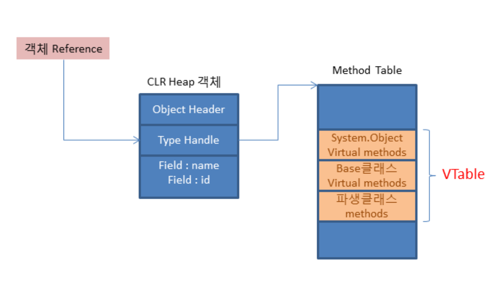
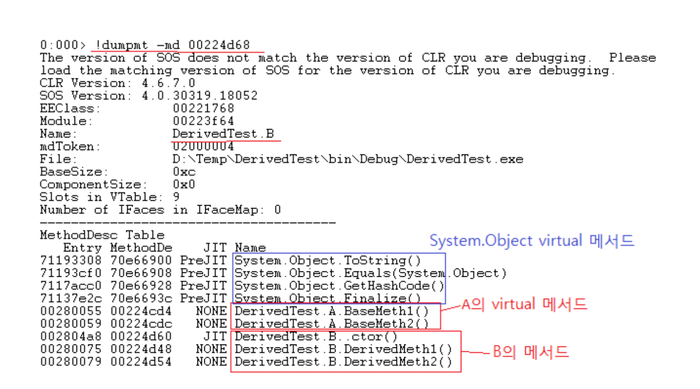
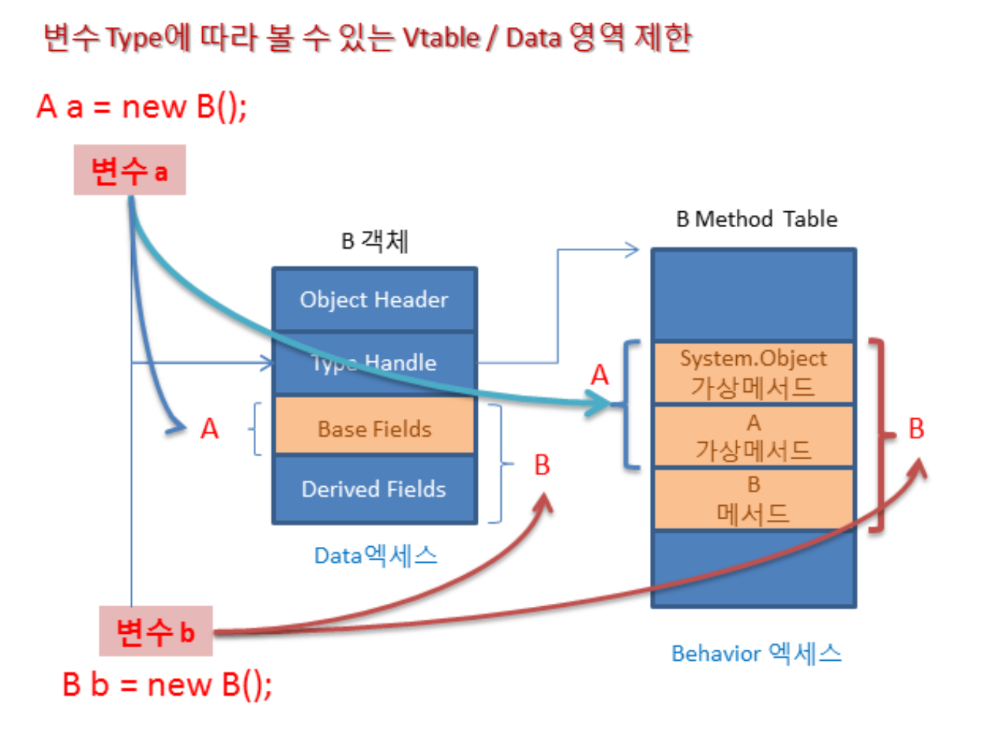

## C# Virtual Table의 구조와 Polymorphism에 관한 이해

**이 아티클은 C#의 Virtual Table 구조를 통해 객체지향프로그래밍의 다형성(** Polymorphism) **이 어떻게 구현되는지를 간략히 정리한 글이다.**

### Virtual Table의 구조

**한 클래스가 해당 클래스 혹은 상위 Base 클래스에서 하나 이상의 가상메서드 (virtual or abstract Method)를 갖는다면, 해당 클래스의 Method Table 메타데이타 내에 Virtual Table을 갖게된다** Virtual Table은 기본적으로 메서드 포인터들을 저장하는 배열로 구성되어 있다.

VTable은 아래 그램에서 보이듯 객체 레퍼런스가 가리키는 Heap 상 객체의 첫부분에 있는 Type Handle이 가리키는 곳의 Method Table 내에 위치한다. CLR 버젼에 따리 실제 VTable이 위치하는 Offset위치는 다르지만, VTable은 이 Method Table 메타 데이터 내에 존재한다.



사실 C# / .NET 에서 모든 클래스(혹은 struct)는 기본적으로 System.Object 클래스로부터 상속되므로 모든 클래스가 VTable을 갖는다. 즉, 모든 클래스는 System.Object 클래스의 4개의 가상메서드(ToString(), Equals(), GetHashCode(), Finalize() )를 자신의 VTable안에 갖게 된다. (주: Java는 모든 메서드가 디폴트로 가상메서드이다. C#은 virtual / abstract 를 지정해야 가상메서드가 된다)

만약 Base클래스가 가상메서드를 갖지 않는다면, 파생클래스는 Base 클래스의 메서드를 VTable 슬롯에 추가하지 않는다. 예를 들어, 다음과 같이 Base클래스 A의 메서드가 virtual 없이 선언 되었다면, 파생클래스의 VTable에는 A의 메서드 슬롯을 갖지 않는다.

```csharp
class A
{
    public virtual void BaseMeth1() { }
    public virtual void BaseMeth2() { }
}
class B : A
{
    public void DerivedMeth1() { }
    public void DerivedMeth2() { }
}
```

위와 같이 Base Class A 에서 virtual 메서드 선언시, 파생 클래스 (B)는 virtual Mthod를 자신의 가상 테이블에 넣게된다.



파생클래스 B의 VTable이 메모리상에서 표현된 것을 보여 주는데, 처음 4개의 메서드는 System.Object의 가상메서드들이고, 다음의 2개는 Base클래스 A의 가상메서드이다. 그리고 마지막으로 파생클래스 B의 virtual 혹은 nonvirtual 메서드들이 있게 된다 (해당 파생클래스의 메서드 슬롯에는 자신의 public 메서드 뿐만 아니라 private 메서드들도 추가된다). **파생클래스가 조부모, 부모 등의 여러 Hierarchy를 갖는다면, 최상위 Base클래스의 가상메서드부터 부모 클래스 그리고 해당 파생클래스까지 계층적인 순서대로 메서드 포인터 슬롯을 갖게된다.**

### 메서드 Overrinding

파생 클래스에서 메서드를 Overriding 을 하는 경우, Base 클래스는 2개의 가상메서드를 가지고 파생클래스는 이중 하나에 대해 메서드만 override 하고 있다.

```csharp
class A
{
    public virtual void Run1() 
    {
        Console.WriteLine("A.Run1");
    }
    public virtual void Run2() { }
}
class B : A
{
    public override void Run1() 
    {
        Console.WriteLine("B.Run1");
    }  
    public void OtherRun() {}
}
// 케이스-A
A a = new A();
a.Run1(); 

// 케이스-B
A x = new B();
x.Run1();  

```

이경우 A 케이스의 경우 A.Run1 이된다 하지만 B의 경우 B.Run 이된다.

이는 객체지향 프로그래밍의 다형성을 표현한 예이다. 다형성은 Base 크랠스의 레퍼런스를 사용하기 위해 하위 계층에 있는 다양한 파생클래스 메서드를 실행할 수있게 하는 기능이다.

한 클래스로부터 객체가 생성되어 어떤 변수에 할당이되었을 때, 변수의 타입에 관계없이 해당 클래스의 Metohd Table을 사용한다는 것이다. 다시말하면, 위에서 클래스 B 로부터 객체가 생성되에 Base 클래스인 A타입으로 변수형이 지정되었더라도 VTable은 B 클래스의 Method Table을 사용한다는 것이다, 둘째, 만약 파생클래스의 객체보다 상위의 Base 클래스의 변수에 할당 시 그 변수느 해당 Base 크래스의 범위 안에서만 사요가능한 메서드를 사용이 가능하다, 아래 그림은 B가 A로 부터 파생된 클래스라는 가정하에 2가지 설명이다.



먼저 케이스-A의 경우 클래스 A의 객체를 생성한 것이므로 다음과 같이 클래스 A의 VTable을 사용할 것이다. 이 VTable을 보면 a.Run1() 메서드 호출은 VTable에서 5번째 메서드 슬롯 즉 A.Run1()을 가리키는 포인터를 사용하게 된다.

케이스-B 의 경우, 클래스 B 객체를 생성한 것이므로 다음과 같이 클래스 B의 VTable을 사용하게 된다.

즉, **Base클래스의 virtual 메서드를 파생클래스에서 override 하면** (1) 파생클래스의 VTable에 있는 Base클래스의 가상메서드 슬롯에 파생클래스 override 메서드의 포인터를 집어 넣고, (2) (override 메서드에 대한) 별도의 파생클래스 메서드 슬롯을 새로 만들지 않는 것이다. 그리고, 이것이 OOP의 Polymorphism을 가능하게 만드는 기본 메커니즘이다.
