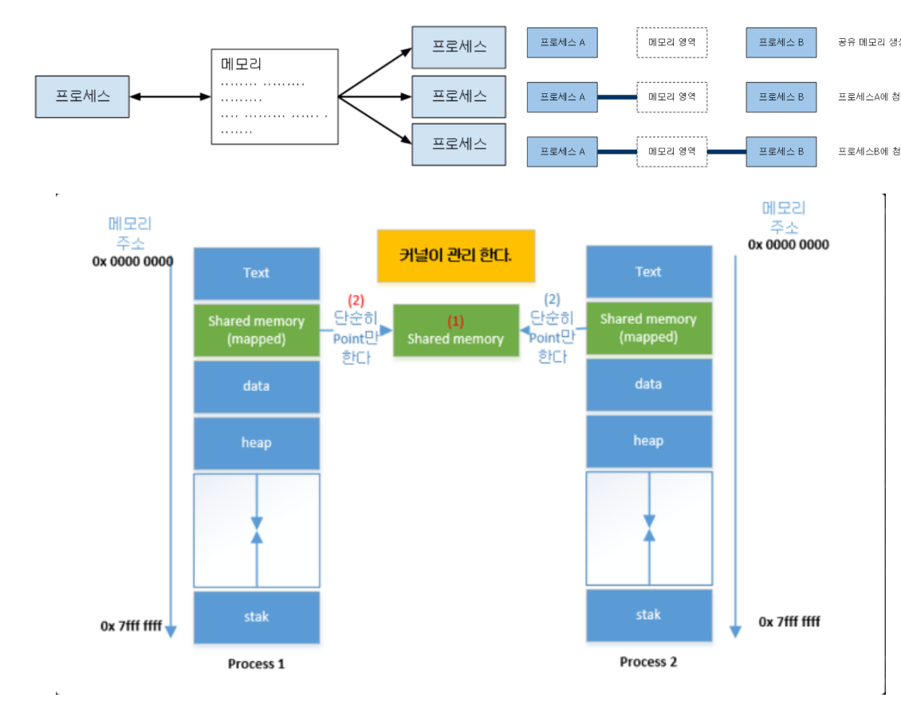
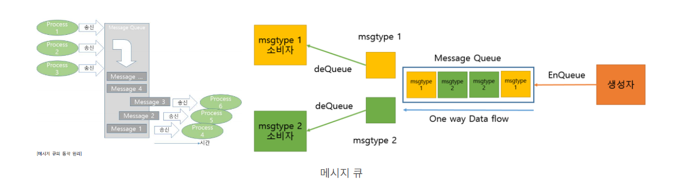
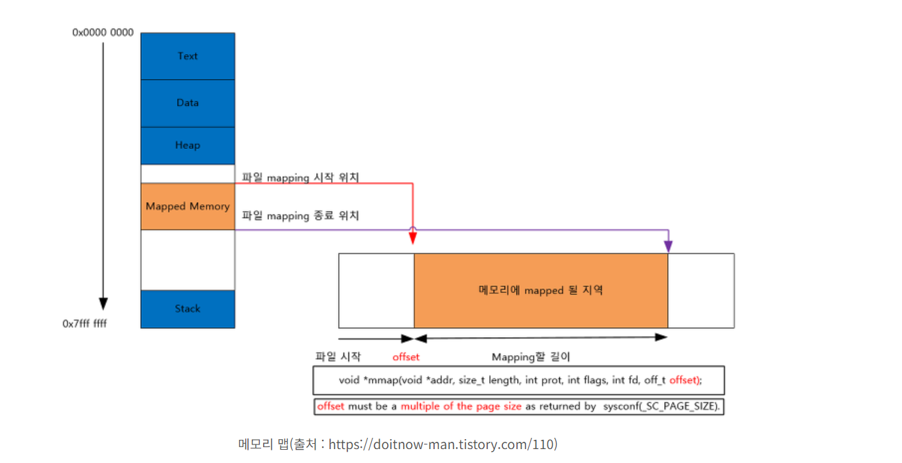
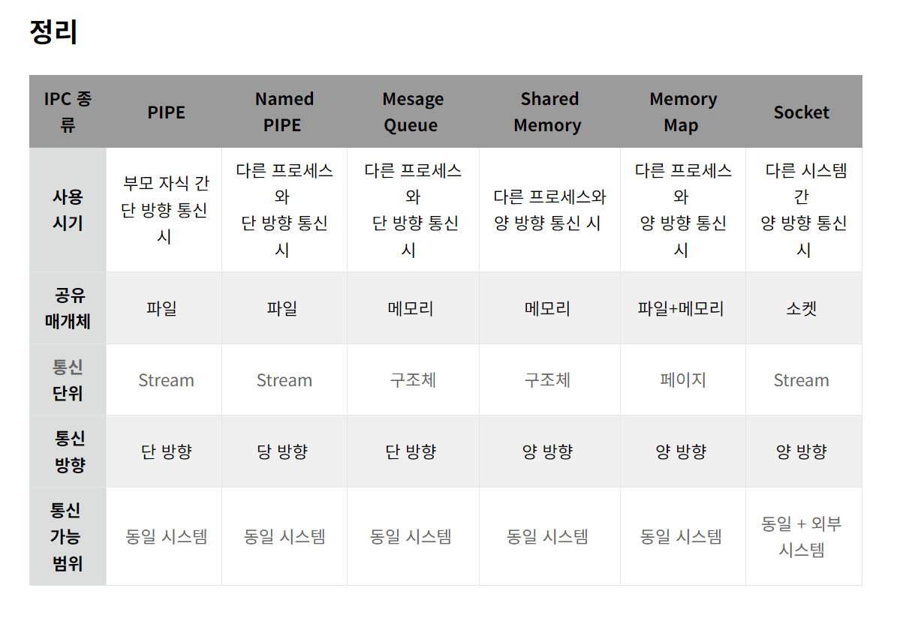

## 개념

프로세스들 간의 의사소통 하는것을 `IPC` 라고 한다. 프로스세가 통신 가능하다는 것은 서로 다른 프로세스가 데이터를 주고 받을 수 있다는 것이며, 동시에 접근 가능한 메모리 즉, *프로세스들이 공유하는 메모리가 필요* 하나는 뜻이다.

따라서 컴퓨터 내부보다 효율적으로 정보를 주고 받기 위한 통신의 일종이며, 인터넷 통신을 IPC의 확장으로 이해할 수 있다.

프로세스간 통신을 위해 '파이프' 같은 개념이 등장

이를 위해 커널 영역에서 IPC라는 내부 프로세스간 통신을 제공하게 되고, 프로세스는 커널이 제공하는 IPC 설비를 이용, 프로세스간 통신을 할 수 있게 된다.

## 종류

### 1. 공유 메모리

* 공유 메모리가 데이터 자체를 공유하도록 진원하는 설비 프로세스간 *메모리 영역을 공유해서 사용* 할수 있도록 허용
* 프로세스가 공유 메모리 할당을 커널에 요청하면 커널은 해당 프로세스에 메모리 공간을 할당
  * 공유메모리가 각 프로세스에게 첨부하는 방식으로 작동
  * 각 프로세스가 메모리 영역에 첨부
* 프로세스간 Read Write를 모두 필요로 할 때 사용
* 대량의 정보를 다수의 프로세스에게 배포 가능
* 중개자 없이 곧바로 메모리에 접근 할 수 있기 때문에 모든 **IPC 중에 가장 빠르다**

### 파이프 (Pipe)

통신을 위한 메모리공간을 생성하여 프로세스가 데이터를 주고 받게 끔 한다.

* 익명 파이프
  * 일반적인 파이프
  * 통신할 프로세스가 명확하게 알 수 있는 경우 사용
    * 부모 - 자식 or 형제 프로세스 간 통신에 사용
    * 이부 프로세스에서 사용 할 수 없다.
  * 파이프는 두개의 프로세스를 연결하고, 하나의 포로세스는 쓰기만, 다른 하나는 데이터를 읽기만 할수 있다. 한쪽 방향으로 통신이 가능한 파이프의 특징 떄문에 반이중 통신 이라 부르기도 한다
  * 송/수신을 모두 원한다면 두 개의 파이프를 만들어야 가능
  * 간단하게사용, pipe 함수 등으로 생성
  * *단점*
    * 전 이중 통신을 고려할 경우 낭비가 심해 좋은 선택이 아니다.
* 네임드 파이프
  * 전혀 모르는 상태의 프로세스들 사이의 통신
  * 익명 파이프의 확장된 상태로 부모 프로세스와 무관한 다른 프로세스도 통신 가능
    * 프로세스 통신을 위해 이름이 있는 파일을 사용
    * FIFO 라 불리는 특수 파일을 이용 서로 관련 없는 프로세스간 통신에 사용
  * mkfifo or mknod 함수로 생성
  * *단점*
    * 반이중 통신

### 3. 소켓

* Unix 도메인 소켓 또는 IPC 소켓은 동일한 호스트 운영 체제에서 실행되는 프로세스간 데이터를 교환하기 위한 데이터 통신 엔드 포인트이다.
* 네트워크 소켓 통신을 통해 데이터를 공유한다.
  * 데이터 교환을 위해 양쪽 PC에서 각각 임의의 포트를 정하고 해당 포트 간의 대화를 통해 데이터를 주고받는 방식이다.
  * 이 때 각각 PC의 PORT를 담당하는 소켓은 각각 하나의 프로세스이다.
  * 즉 해당 프로세스는 임의의 PORT를 맡아 데이터를 송수신 하는 역할을 진행하는 프로세스인 것 입니다.
  * 각각의 PC에서 프로세스를 통해 타 PC PORT에 연결하라는 명령을 보내게 되면 두 프로세스는 서로 확인과정을 거쳐 연결을 진행하고 연결 후 마치 PIPE와 같이 **1 대 1로 데이터를 주고받는 방식**이다.
* 클라이언트와 서버가 소켓을 통해서 통신하는 구조로, **원격에서 프로세스 간 데이터를 공유**할 때 사용한다.
* **전이중(Full Duplex, 양방향) 통신**이 가능하다.
* 서버/클라이언트 환경을 구축하는데 용이하다.
* 서버(bind, listen, accept), 클라이언트(connect)
* 중대형 애플리케이션에서 주로 사용한다.

### 4. 메시지 큐

* 입출력 방식은 Named 파이프와 동일
* 다른점
  * 메시지 큐는 파이프처럼 데이터의 흐름이 아니라 `메모리 공간` 이다
  * PIPE 나 FIFO 와는 달리 다수의 프로세스간 메시지를 전달이 가능
* 사용할 데이터에 번호를 붙이면서 여러 프로세스가 동시에 데이터를 쉽게 다룬다
* 메시지의 접근을 위해서는 Key 가 필요

### 5. 메모리 맵

* 공유 메모리 처럼 메모리를 공유
* 메모리 맵은 `열린 파일을 메모리에 맵핑 시켜서 공유`하는 방식이다 (즉 공유 매개채가 파일 + 메모리)
* 주로 `파일로 대용량 데이터를 공유할 때 사용`
* FILE IO 가 느릴때 사용 시 좋다
* 프로세스를 실행 할 때 실행파일의 각 세그먼트를 메모리에 사상하기 위해 메모리 맵파일을 이용
* 메모리 맵 파일은 파일의 크기를 바꿀 수 없으며 메모리 맵 파일을 사용하기 이전, 또는 이후에만 크기를 바꿀 수 있다

### RPC (Remote Procedure Call)

* RPC 방법은 분산 네트워크 망에서 많이 사용된다.
* 다른 주소 공간에서 하뭇나 프로시저를 실행할 수 있게 하느 프로세스 간 통신 기술이다. 즉, 원결 프로시저 호출을 이용하면 프로그래머는 함수가 실행 프로그램에서 로컬위치에 있든 원격 위치에 있든 동일한 코드사용이 가능
* 해당 방법은 분리된 PC에 저장된 데이터를 마치 내 PC에 존재하는 것처럼 데이터를 가져와 사용하는 통신 방법이다.

  * Stub 을 통해서 마치 자신의 디스크에 존재하는 것 착각을 일으켜 사용
    * Stub  : 리눅스에서 공유 라이브러리의 일부 중 하나
    * 플시져 : 루틴, 서브루틴, 함수 아 같은 뜻으로 사용되며 하나의 프로시저는 특정 작업을 수행하기 위한 일련의 작업 순서를 말한다.

>  이런한 IPC 통신에서 프로세스 간 데이터를 동기화 하고 보호하기 위해 세마포어와 뮤텍스를 사용ㅎ나다

