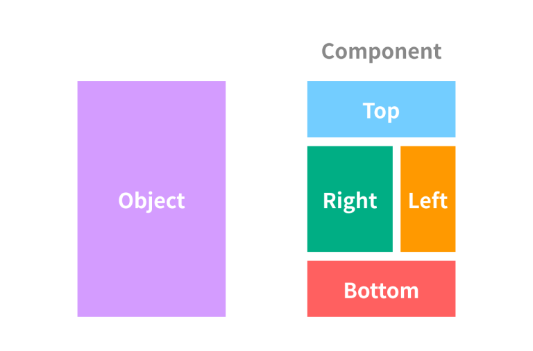

# 컴포넌트란?

컴포넌트는 프로그래밍에 있어 재상요이 가능한 각각의 독립된 모듈을 뜻한다.
## 컴포넌트의 규격
* **Shadow DOM** : Dom과 스타일을 캡슐화 하여 메인으로부터 독립적으로 스크립트와 스타일을 처리할 수 있도록 한다.
* **Custom Elements** : HTML에 샐운 HTML/DOM 요소를 정의 할수 있는 JavaScript API
* **ES Modules** : 이전 규격 HTML Import를 대처하여 나온 규격으로 JavaScript로 구현하는 모듈 시스템
## 컴포넌트 개념을 객체 지향 언어에 대입
1. 컴포넌트는 독립적인 소프트웨어 모듈이다.
   1. 독립적인 *모듈* 로 이후 시스템을 유지보수 하는데 있어 *교체가 가능한 부품*이다.
2. 컴포넌트는 구현, 명세화, 패키지화, 그리고 배포 될 수 있어야 한다.
3. 하나의 컴포넌트는 하나이상의 클래스로 구성 될수 있따.
4. 컴포넌트는 인터페이스를 통해서만 접근이 가능해야 한다.
   1. 컴포넌트 정보는 외부로부터 모두 숨겨진다.(은닉)

## 컴포넌트의 종류
* page : 모든 구성요소를 포함하는 가장 큰 단위로 single template와 multi-page template 이 있다.
* dialog : 대화상자
* header bar : 상단에 위치하면서 제목을 표시하고 페이지 이동과 관련된 버튼이 위치한다.
* footer bar : 페이지 하단에 위치하면서 버튼이 위치한다.
* navbars : 일반적으로 header bar 나 footer bar 내에 위치하면서 특정한 페이지로 이동하는 메뉴의 역할
* button : 버튼
* form : 사용자로부터 데이터를 입력받는 컨트롤
* list view : 여러개의 항목을 열거하는데 사용되는 컨트롤