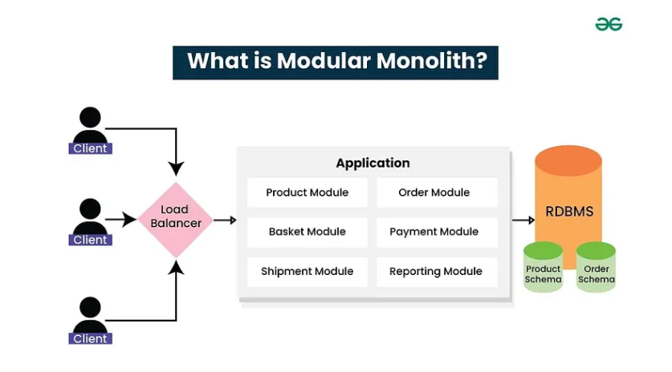
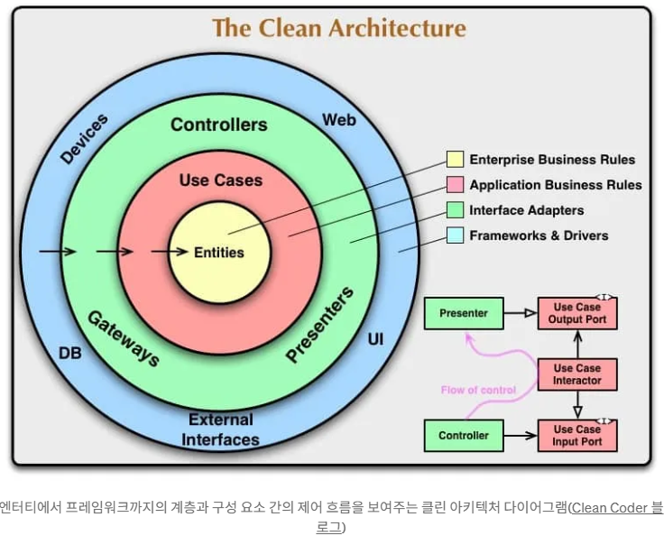

# Software Architectures1

[Bhargava Koya - Fullstack .NET Developer – Medium](https://medium.com/@bhargavkoya56/from-chaos-to-clarity-mastering-software-architectures-that-scale-in-the-modern-world-part-i-e3dffd8da7b0)

## 아키텍쳐가 중요한이유

* 확장성의 악몽
  * 100명의 사용자를 위한 프로그램이 10000명의 사용자에게 제공시 실패하게 된다, 기존의 서버를 추가하면된다는 접근 방식은 비싸고 기술적으로 실현이 불가하다
* 배포 병목 현상
  * 긴밀하게 결합된 시스템은 하나의 작은 기능을 변경하기 위하ㅐ 전체 애플리케이션을 다시 배포해야 하는 종속송이 생겨 위험이 증가하고 배포가 느려진다
* 기술 스택 제한사항
  * 종종 오래된 기술에 갇히는 경우가 많은데, 이는 모놀리식 시스템을 마이그레이션하면서 전체 앱을 다시 작성해야하기 떄문이다
* 팀 협업 과제
  * 개발팀이 성장함에 따라 동일한 코드베이스에서 작업하는 여러개발자로 인한 충돌, 병목현상 및 커뮤니케이션 오베헤드가 발생한다, 모든사람이 모든것을 만지는 전통적인 모델은 지속이 불가하다
* 유지관리의 복잡성
  * 시스템끼리 결합되어 복잡한 시스템으로 발전하게되어, 한 영역의 작은 변화는 전체 시스템의 영향을 미치게 되어 유지관리는 힘들어진다

## 소프트웨어 아키텍쳐란 무엇인가

소프트웨어 시스템의 기본 구조로, 구성요소가 상호작용하는 방식, 데이터 흐름 방식, 시스템이 성능, 확장성 및 유지관리성과 같은 다양한 품질 요구사항에 대응하는 방식을 정의한다, 단순히 코드를 구성하는것이 아니라 향후 몇년동안 애플리케이션에 영향을 미칠 전략적 결정을 내리는것이다

소프트웨어 설계자는 설계시 확장성, 유지관리 가능성 및 사용자 경험을 고려해여 작성해야한다.

### 주요 개념

* 관심사의 분리
  * 프로그램은 서로다른 구성요소에서 처리 해야한다, 이우너칙은 한가지 관심사에 대한 변경사항이 전체 시스템에 파급되지 않도록 한다
* 모듈성
  * 복잡한 시스템을 독립적으로 개발, 테스트 및 배포할 수있는 더 작고 관리 가능한 조각으로 분해
* 느슨한 결합
  * 구성요소는 구체적 구현이 아닌 추상화에 의존해야한다
* 높은 응집도
  * 관련 기능을 그룹화하여 시스템을 더 쉽게 이해하고 유지관리할 수 있도록 해야한다
* 확장성
  * 완전한 재작성 없이 사용자, 데이터 및 기능의 증가를 지원해야한다

## 아키텍쳐 패턴

### 모놀리식 아키텍쳐 패턴

전체 애플리케이션이 하나의 통합된 단위로 구축되는 전통적인 접근 방식을 나타낸다. 사용자 인터페이스, 비지니스로직 및 데이터 엑세스와 같은 모든 구성요소는 긴밀하고 통합되고 함께 배포된다

장점

* 스타트업 프로젝트
  * 아이디어를 신속하게 검증
* 소규모팀
* 간단한 프로그램
* 개념 증명

실제 구현 구조

```
ECommerceApp/
├── Controllers/
│   ├── ProductController.cs
│   ├── OrderController.cs
│   └── UserController.cs
├── Services/
│   ├── ProductService.cs
│   ├── OrderService.cs
│   └── UserService.cs
├── Models/
│   ├── Product.cs
│   ├── Order.cs
│   └── User.cs
└── Data/
    └── ApplicationDbContext.cs
```

### 모듈러 모놀리식 아키텍쳐

단순성을 유지하면서, 많은 모놀리식 한계를 해결한다. 애플리케이션을 명확한 경계가 이쓴ㄴ 잘 정의된 모듈로 구조화 하며, 모두 단일 배포 가능한 장치에 있다

핵심원칙

* 모둘경계
  * 각 모듈은 명확한 인터페이스로 특정 비지니스 기능을 캡슐화
* 스키마 있는 공유 데이터 베이스
  * 단일 데이터베이스를 사용하는 동안 각 모듈은 자체 스키마를 유지 관리
* 내부 API
  * 모듈은 직접 코드 종속성이 아닌 잘 정의된 내부 인터페이스를 통해 통신

```csharp
// Product Module
namespace ECommerce.Modules.Products
{
    public interface IProductService
    {
        Task<Product> GetProductAsync(int id);
        Task<IEnumerable<Product>> SearchProductsAsync(string query);
    }

    public class ProductService : IProductService
    {
        private readonly IProductRepository _repository;
  
        public ProductService(IProductRepository repository)
        {
            _repository = repository;
        }
  
        public async Task<Product> GetProductAsync(int id)
        {
            return await _repository.GetByIdAsync(id);
        }
    }
}

// Order Module
namespace ECommerce.Modules.Orders
{
    public class OrderService : IOrderService
    {
        private readonly IProductService _productService;
  
        public OrderService(IProductService productService)
        {
            _productService = productService;
        }
  
        public async Task<Order> CreateOrderAsync(CreateOrderRequest request)
        {
            // Validate products exist
            var products = await _productService.SearchProductsAsync(request.ProductIds);
      
            // Create order logic
            return new Order { Name="Book", PaymentId=23566};
        }
    }
}
```



장점

* 배포 단순성
* 코드 수정 용이
* 개선 - 모듈내 팀 자율성
* 마이크로 서비스로의 점진적인 마이그레이션

### 계층화된 아키텍처: 복잡성 구성

> N-Tire 재단
>
> 계층화된 아키텍쳐는 애플의 수평 계층으로 구성하며, 각 계층은 특정 문제를 담당한다,

#### 표준 레이어

* 프리젠 테이션 레이어
  * 사용자 인터페이스 및 사용자 상호 작용 논리 처리
* 비지니스 로직 계층
  * 응용프로그램별 비지니스 규칙 및 워크 플로
* 데이터 엑세스 계층
  * 데이터 지속성 및 검색 작업을 관리
* 데이터베이스 계층
  * 데이터를 저장하고 관리

구현 전략

```csharp
// Presentation Layer
[ApiController]
[Route("api/[controller]")]
public class ProductController : ControllerBase
{
    private readonly IProductService _productService;
  
    public ProductController(IProductService productService)
    {
        _productService = productService;
    }
  
    [HttpGet("{id}")]
    public async Task<ActionResult<ProductDto>> GetProduct(int id)
    {
        var product = await _productService.GetProductAsync(id);
        return Ok(new ProductDto { /* mapping logic */ });
    }
}

// Business Logic Layer
public class ProductService : IProductService
{
    private readonly IProductRepository _repository;
    private readonly IInventoryService _inventoryService;
  
    public async Task<Product> GetProductAsync(int id)
    {
        var product = await _repository.GetByIdAsync(id);
    
        // Business logic
        if (product.IsDiscontinued)
        {
            throw new ProductNotFoundException();
        }
    
        // Check inventory
        product.StockLevel = await _inventoryService.GetStockLevelAsync(id);
    
        return product;
    }
}

// Data Access Layer
public class ProductRepository : IProductRepository
{
    private readonly ApplicationDbContext _context;
  
    public async Task<Product> GetByIdAsync(int id)
    {
        return await _context.Products
            .Include(p => p.Category)
            .FirstOrDefaultAsync(p => p.Id == id);
    }
}
```

장점

* 관심사의 분리
* 유지관리
* 병렬개발
* 각 계층에서의 테스트 용이성

주의

* 시간 경과에 따른 계층 성능 오베헤드
* 비지니스계층에서 의 복잡성 위험

### 클린 아키텍쳐 : 종속성 반전 숙달

프레임워크. 데이터베이스 및 외부 문제로서의 독립성을 강조한다, 핵심 원칙은 비지니스 규칙이 외부 세부사항에 의존해서는 안된다.



> 네 개의 원
>
> * Entities (기업 비지니스 규칙)
>   * 가장 일반적인 규칙을 구현하는 핵심 개체
> * UseCases ( 애플리 케이션 비지니스 규칙)
>   * 어플리케이션별 비지니스 규칙
> * Presenters(인터페이스 어뎁터)
>   * 사용 사례와 외부 시스템간 데이터를 파싱
> * Exteranl Interface(프레임워크 및 드라이버)
>   * 데이터 베이스, 웹 프레임워크, API 같은 외부 도구

구현 예제

```csharp
// Domain Layer - Entities
public class Product
{
    public int Id { get; private set; }
    public string Name { get; private set; }
    public decimal Price { get; private set; }
    public ProductStatus Status { get; private set; }
  
    public void UpdatePrice(decimal newPrice)
    {
        if (newPrice <= 0)
            throw new ArgumentException("Price must be positive");
        
        Price = newPrice;
    }
  
    public void Discontinue()
    {
        Status = ProductStatus.Discontinued;
    }
}

// Application Layer - Use Cases
public class GetProductUseCase
{
    private readonly IProductRepository _repository;
  
    public GetProductUseCase(IProductRepository repository)
    {
        _repository = repository;
    }
  
    public async Task<Product> ExecuteAsync(int productId)
    {
        var product = await _repository.GetByIdAsync(productId);
    
        if (product == null)
            throw new ProductNotFoundException();
        
        return product;
    }
}

// Infrastructure Layer - Interface Adapters
public class ProductRepository : IProductRepository
{
    private readonly ApplicationDbContext _context;
  
    public async Task<Product> GetByIdAsync(int id)
    {
        var entity = await _context.Products.FindAsync(id);
        return entity?.ToDomainModel();
    }
}

// Web Layer - Controllers
[ApiController]
[Route("api/[controller]")]
public class ProductController : ControllerBase
{
    private readonly GetProductUseCase _getProductUseCase;
  
    [HttpGet("{id}")]
    public async Task<ActionResult<ProductResponse>> GetProduct(int id)
    {
        var product = await _getProductUseCase.ExecuteAsync(id);
        return Ok(new ProductResponse(product));
    }
}
```

장점

* 종속성 반전을 통한 테스트
* 데이터 베이스의 독립성
* 관심사의 명확한 분리

이성적인 대상

* 엔터프라이즈 애플리케이션
* 장기 유지 관리 프로젝트
* 광범위한 테스트가 필요한 애플리케이션

### CQRS : 명령 쿼리 책임 분리

읽기와 쓰기

명령과 쿼리 처리하는 책임을 분리한다, 이러한 분리를 통해 최적화된 데이터 모델과 향상된 성능을 얻을 수 있다.

#### 핵심개념

* 명령
  * 시스템상태를 변경 즉, 데이터를 변경
* 쿼리
  * 부작용 없이 데이터를 검색
* 별도의 모델
  * 읽기 쓰기 작업을 위한 다양한 데이터 모델
* 이벤트 소싱
  * 완전한 감사 추적을 위해 결합

장점

* 최적화된 읽기 및 쓰게 모델
* 쿼리성능
* 확장성 향상
* 관심사의 명확한 분리 향상
