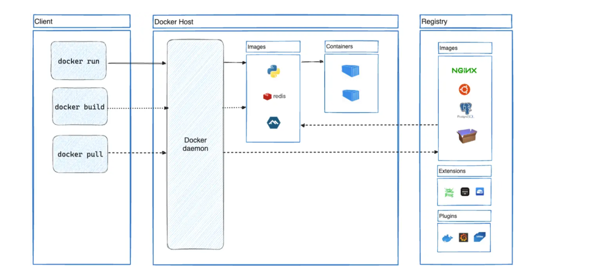

# Docker

Docker는 애플리케이션을 개발, 배포, 실행하기 위한 플랫폼이다.

Docker는 여러개의 컨테이너를 동일한 호스트에서 동시 실행이 가능하게 도와주는 플랫폼이며 호스트에 의존할 필요가 없다.

## 도커의 활용

### 빠르고 일관된 애플리케이션 배포

Docker는 개발자들이 로컬 컨테이너에서 표준화된 환경에서 작업이 가능하다. 

패포예시

1. 로컬환경에서 개발
2. 테스트 환경 배포
3. 버그처리
4. 테스트 후 운영환경 배포
   * 테스트완료 시 업데이트된 이미지를 프로덕션 환경에 푸시하는것만으로 수정사항을 고객에게 전달

### 유연한 배포  및 확장

### 동일한 하드웨어에서 더 많은 워크로드 실행

## Docker 아키텍쳐

클라이언트와 호스트 그리고 레지스트리에 구서요소를 통해 Docker일을 원할하게가능하다

### Docker 데몬

Docker API 요청을 수신하고 이미지, 컨테이너, 네트워크, 볼륨등의 Docker 객체를 관리한다, 

### Docker 클라이언트

Docker 사용자가 Docker와 상호작용하는 방법이다. Docker API를 이용 하여 명령을 내린다

### Image

이미지는 DOcker 컨테이너를 생성하기위한 명령이 포함된 읽기전용 템플릿이다.

### 컨테이너

이미지의 실행 가능한 인스턴스이다. Docker API 를 사용 컨테이너를 생성, 시작, 중지 이동 또는 삭제가 가능하다. 

컨테이너를 하나 이상의 네트워크에 연결하거나, 스토리지를 연결, 심지어 현재상태를 기반으로 새로운 이미지를 만들 수 있다.

컨테이너가 제거된다면 영구 스토리지에 저장하지 않은 상태 변경사항은 사라진다 때문에 컨테이너에서 수행한 작업을 보존하고 싶다면 영구 스토리지에 별도로 저장하는 작업이 필요하다.
