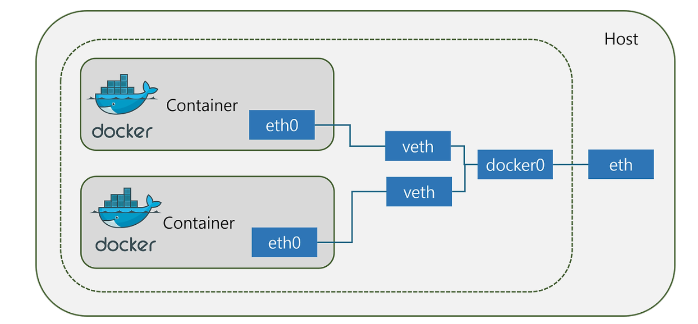

# Docker Network

Docker 컨테이너는 독립되었지만 서로간에 네트워크를 통해 통신이 필요하다, 서비스의 규모를 작게 축소하여 배포하는 대신, 작은 서비스 간의 통신을 해야할 상황이 많아져 이때 중요한 역할을 하는것이 Docker Network 이다

## Docker Network 란?



Docker 네트워크는 컨테이너들이 서로 통신할 수 있게 해주는 가상의 네트워크이다, 네트워크를 통해 컨테이너 간의 데이터 전송, 서비스 발견, 외부 네트워크와의 연결 등이 가능하다. Docker는 다양한 네트워크 드라이버를 제공하여, 컨테이너 간의 통신 방식을 세밀하게 제어한다.

## Dokcer 네트워크 주요 개념

### 1. 네트워크 드라이버

도커 네트워크는 네트워크 드라이버를 통해 구현, 각 드라이버는 컨테이너간의 통신을 설정하는 방법을 정의하며, 도커는 기본적으로 아래와 같은 네트워크 드라이버를 제공한다.

* Bridge (브리지)
  * 기본 네트워크 드라이버로, 동일한 Docker 호스트 내의 컨테이너가 통신할 수 있도록한다, 외부 네트워크 통신을 위해 NAT 을 사용한다.
* Host (호스트)
  * 컨테이너가 Docker Host 네트워크를 직접 사용, 호스트 네트워크와 동일한 네트워크 설정
* None
  * 네트워크 비활성화
* Overlay
  * 여러 Docker 호스트에 걸쳐 있는 컨테이너들이 네트워크를 통해 통신
  * Swarm 모드에서 주로 사용되며, 멀티-호스트 네트워킹이 가능
* ipvlan
  * IPv4 와 IPv6 주소 모두에 대해 제어 가능
* Macvlan
  * 실제 물리적 네트워크 인터페이스 처럼 동작하는 가사으이 네트워크 인터페이스를 할당
  * 컨테이너 고유의 MAC 주소를 부여, 컨테이너를 물리적 네트워크에 직접 연결이 가능

### 2. 서브넷고 IP 주소

각 도커 네트워크는 서브넷과 IP 주소 범위를 가진다.

Bridge 네트워크의 경우 기본적으로 172.17,0,0/16 의 범위가 할당된다

### 3. 서비스 디스커버리

Docker 네트워크는 컨테이너 이름을 기반으로 서비스 디스커버리를 제공한다, 서로의 이름을 DNS이름으로 사용이 가능하며, 이를 토앻 복잡한 IP 주소 대신 쉽게 통신이 가능하다, 

### 4. 포트 바인딩

외부 네트워크와 통신하기위해 포트 바인딩을 사용한다, 

---

## Docker 네트워크 사용 방법

### 1. 사용자 정의 브리지 네트워크 생성

사용자 정의 브리지 네트워크를 생성시, 컨테이너 간의 통신을 더 세밀하게 제어가 가능하다. 사용자 정의 네트워크를 생성 후 각 컨테이너 생성 시 생성한 네트워크를 지정해준다, 드러면 사용자 정의 네트워크에 컨테이너들이 연결되어 통신이 가능하다

사용 예시

```
코드 복사
# 사용자 정의 네트워크 생성
docker network create my_bridge_network

# 네트워크에 연결된 컨테이너 생성
docker run -d --name container3 --network my_bridge_network nginx
docker run -d --name container4 --network my_bridge_network nginx

# 컨테이너3에서 컨테이너4로 ping 테스트
docker exec container3 apt-get update
docker exec container3 apt-get install inetutils-ping -y
docker exec container3 ping container4
```

### Host 네트워크 사용

Host 네트워크를 사용하면 컨테이너가 호스트 네트워크와 동일한 네트워크 설정을 공유합니다.

```
코드 복사
# Host 네트워크를 사용하는 컨테이너 생성
docker run -d --name container5 --network host nginx

# 컨테이너5는 호스트와 동일한 IP 주소를 사용합니다.
```

### Macvlan 네트워크 사용

Macvlan 네트워크는 컨테이너에 물리적 네트워크 인터페이스처럼 동작하는 인터페이스를 할당합니다. 이러한 방식은 실제 사무실 등에서 팀 별로 네트워크를 분할하여 사용하는 것처럼 Docker 컨테이너들 간의 그룹을 지어 네트워크를 분할할 수 있습니다

```
코드 복사
# Macvlan 네트워크 생성
docker network create -d macvlan \
    --subnet=192.168.1.0/24 \
    --gateway=192.168.1.1 \
    -o parent=eth0 macvlan_network

# Macvlan 네트워크를 사용하는 컨테이너 생성
docker run -d --name container6 --network macvlan_network nginx
```
