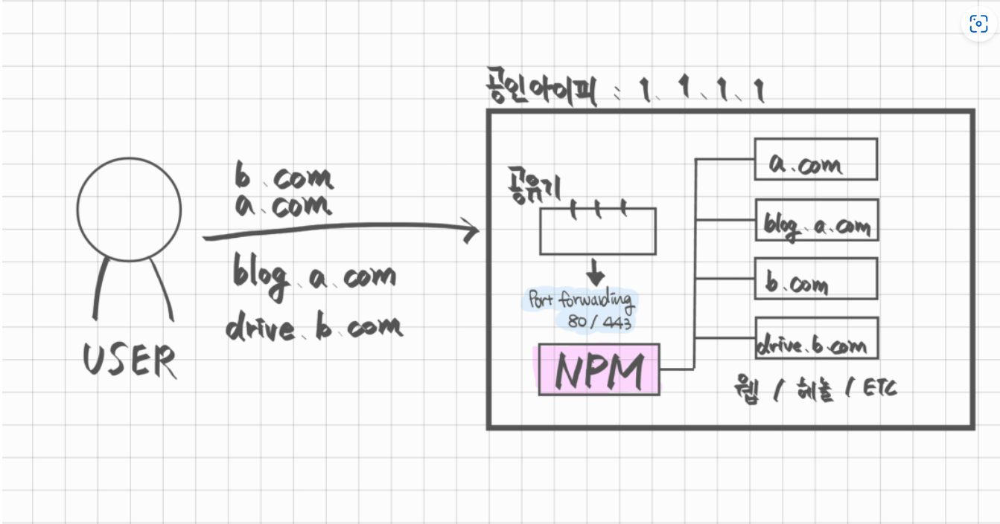
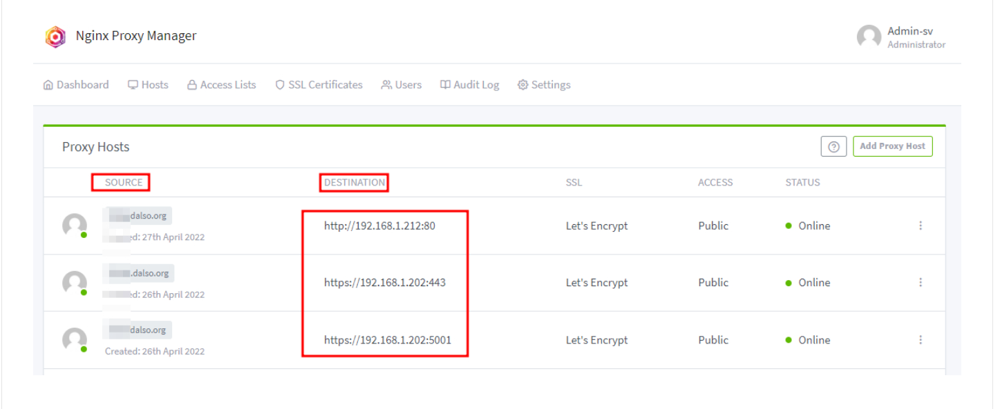

# 역방향 프록시 설정

도메인을 직접 구하거나 공유긴의 DDNS를 사용하게 된다.

이렇게 공인 IP를 도메인에 할당 시 해당 도메인으로 접근하면 내부의 서버에 포트포워딩/DMZ 설정을 사용해서 내부로 요청을 보낸게 된사.

역방향 프로시를 사용하지 않는다면 포트를 통해 내부 서버가 분기되면 서비스당 포트 1개씩을 사용하게된다. 이렇게될 시 실제로 사용되는 포트도 많아지고 여러서버를 운용시 관리하기 복잡하다(인증서 등등)

역방향 프록시를 사용시 이런 문제를 쉽게 해결이 가능하다.

## Reverse Proxy란?

역방향 프록시로 일반적인 내부에서 외부로 나갈떄의 프록시 서버의 반대로 외부에서 내부로 서버의 요청이 왔을때 처리해주는 서비스이다.

아래 그림처럼 사용자가 도메인에대한 요청을 도메인 (ip)에 보내게 되면 80/443으로 포트포워딩 된 NPM 서버에서 해당 요청을 확인하고 알맞은 내부서버로 전달해줘 요청을 처리한다.

위 사진을 설명하면 외부의 도메인은 NPM 서버의 80/433으로 포트포워딩 되어 있는 상태이다. 그리고 NPM에서 여러가지 도메인에 대한 설정을 진행해준다.

Souce는 도메인 주소를 의미하면 Destnation은 내부의 서버를 의미한다. 내부에서 요청을 처리하는건 Reverse Proxy 서버 한대이기 때문에 https를 사용하기 위한 인증서 관리도 매우 편리하다.

ㅇ

NPM을 사용해 응용프로그램의 도메인을 설정 시 요청에 대해 알아서 domain을 인식하고 넘겨주기때문에 dst ip는 443 으로 적어도 충분하다.
