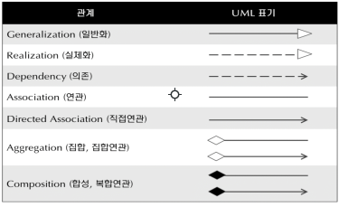
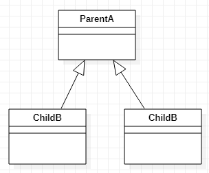
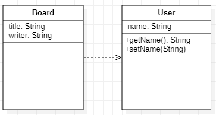

# 클래스 다이어그램(Class diagram) 작성

## 클래스 다이어그램
---
* 시스템 일부 또는 전체의 구조를 나타낼 수 있다.
* 의존 관계를 명확하게 보여주며, 순환 의존이 발생하는 지점을 찾아 어떻게 순환고리를 꺨 수 있을지 결정한다.

## 클래스의 구성

* 클래스의 이름
* 속성
* 함수 등을 포함한다
  
| 접근 제어 자|표시|설명|
|---|---|---|
| public|**+**|어떤 클래스의 객체에서든 접근이 가능|
|private |**-**|이 클래스에서 생성된 객체만 접근 가능|
|protected|**#**|이클래스의 상속관계 에서만 접근가능|
|package|**~**|동일 패키지 클래스만 접근가능|

## 클래스 다이어그램 관계표현
---

### **일반화**

상속 관계를 표시할 떄 아래와같이 사용

### **의존**
의존 관계는 클래스간 참조가 일어나는것을 말한다.  
메서드내 다른 클래스를 생성하거나 사용시 아래와 같이 사용

