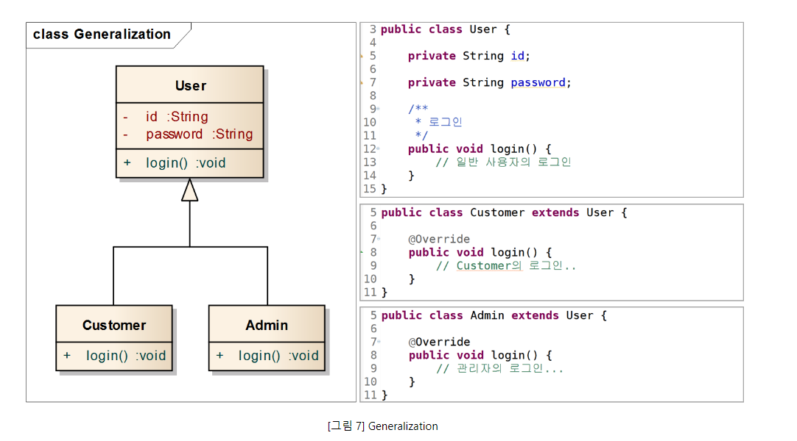
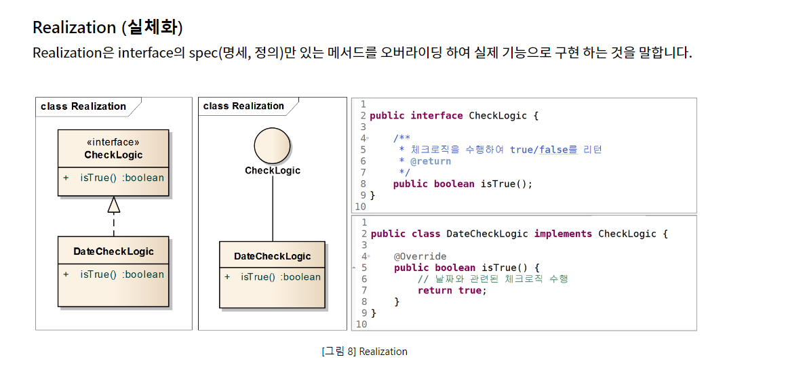
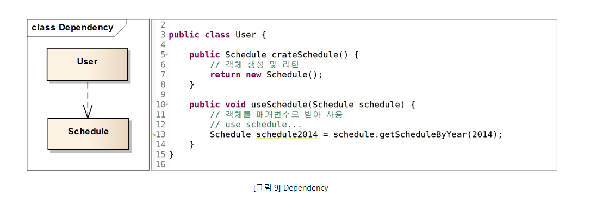
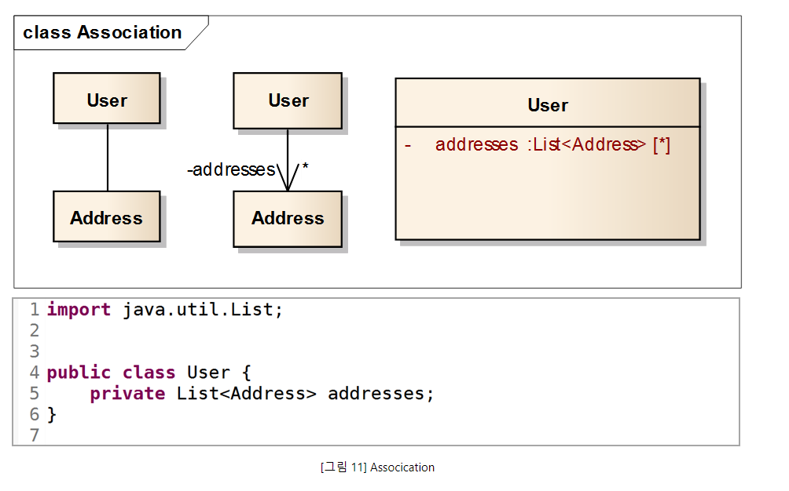
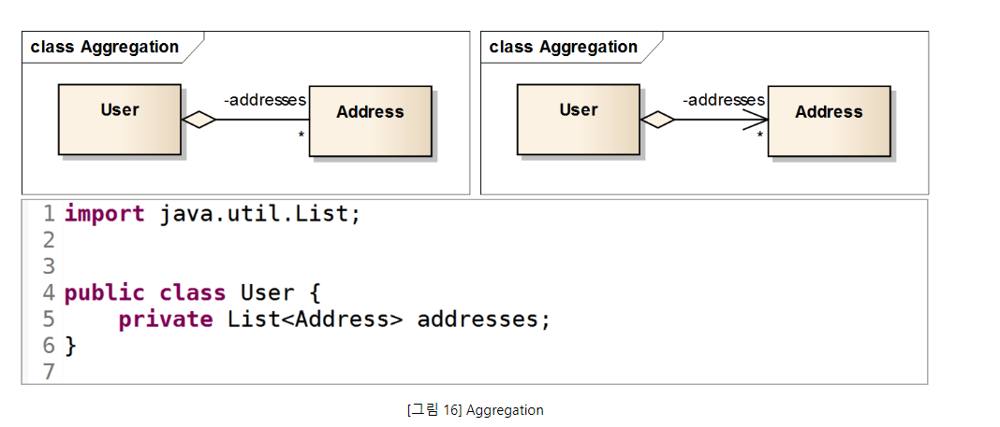

# 클래스 다이어그램(Class diagram) 작성

## 클래스 다이어그램

---

* 시스템 일부 또는 전체의 구조를 나타낼 수 있다.
* 의존 관계를 명확하게 보여주며, 순환 의존이 발생하는 지점을 찾아 어떻게 순환고리를 꺨 수 있을지 결정한다.

## 클래스의 구성

* 클래스의 이름
* 속성
* 함수 등을 포함한다

| 접근 제어 자 | 표시        | 설명                                  |
| ------------ | ----------- | ------------------------------------- |
| public       | **+** | 어떤 클래스의 객체에서든 접근이 가능  |
| private      | **-** | 이 클래스에서 생성된 객체만 접근 가능 |
| protected    | **#** | 이클래스의 상속관계 에서만 접근가능   |
| package      | **~** | 동일 패키지 클래스만 접근가능         |

## 클래스 다이어그램 관계표현

---

### **Generalizaion (일반화)**

부모클래스와 서브 크랠스간의 상속을 나타낼 떄사용.

### Realization(실제화)

Interface의 spec만 있는 메서드를 오버라이딩하여 실제 기능을 구현하는것

### **Dependency (의존)**

의존 관계는 클래스간 참조 일어나는것을 말한다.
메서드내 다른 클래스를 생성하거나 사용시 아래와 같이 사용

참조의 형태는 메서드내에서 대상 클래스의 객체 생성, 객체 사용, 메서드 호출, 객체리턴, 매개변수로 해당 객체를 받는것을 말하며 해당객체의 참조를 유지하지는 않는다.

### Association (연관), Directed Association(방향성 있는 연관)

Association은 보통 다른 객체의 참조를 가지는 필드를 의미한다.

화살표가 의미하는 것은 방향성인데 이것에 따라 참조하는 쪽과 참조 당하는쪽을 구분한다. 두번째 다이어그램은 User에서 Address쪽으로 화살표가 있으므로 User가 Address를 참조하는것을 의미한다. 방향 성이없는것은 User가 Address를 참조할수도, Address가 User를 참조할수 도 있거나 둘다 일수도 있는것을 의미한다.

*는 개수를 나타내는데 여러개일수 있다는것을 의미한다.

3번쨰 다이어그램으로 나타낼수도 있다.

### Aggregation (집합)

전체와 부분의 관계를 나타낸다.

