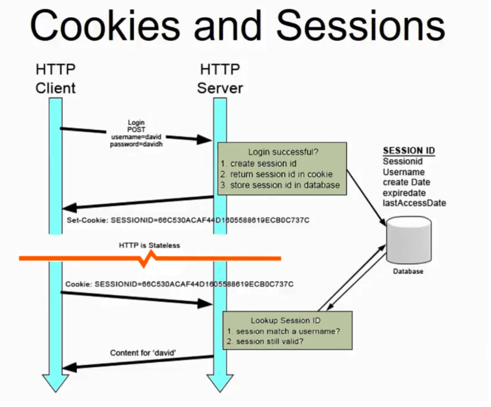
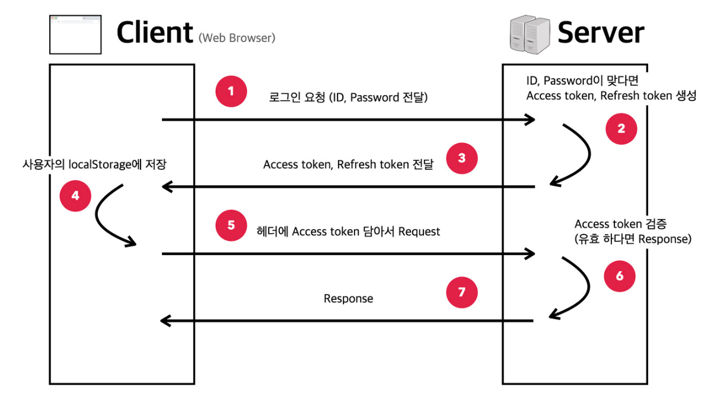
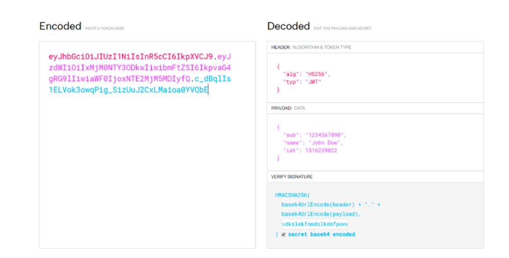
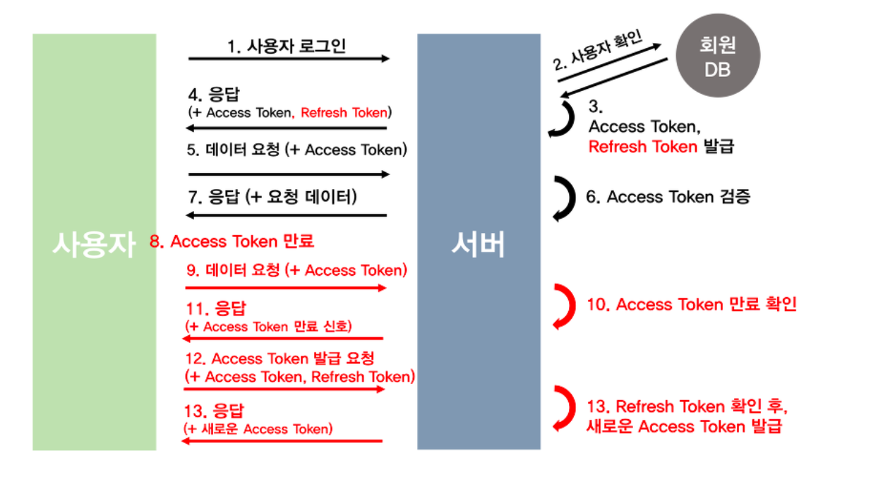

# Session 과 Token의 차이

### Stateless 한 프로토콜 HTTP

HTTP는 Stateless 한 특성 떄문에 각 통신 상태는 저장되지 않는다. 하지만 서비스에서 어떤 유저가 기능을 사용하는지 특정 할 수있어야하는데 이를 위해서는 세션과 토큰이 사용된다.

유저가 로그인을 시도 시 서버 상에서 일치하는 유저정보를 찾았다면 인증확인의 표시로 세션이나 토큰을 발급한다. 세션가 토큰의 차이는 세션은 데이터베이스 서버에 저장된다는 것이고, 토큰은 클라이언트에 저장된다는 것이다.

## Cookie + Session

쿠키에 ID, PW 와 같은 중요한 정보가 아닌 인증으위한 별개의 정보를 세션 저장소에 저장하고, 클라이언트는 세션을 쿠키에 담아 서버에 요청한다. 이 떄 서버는 세션 저장소에 있는 세션과 일치하는지 즉, 유효한 세션인지 확인후 적절한 응답을 보낸다.

> 쿠키 저장소는 어디?
>
> 쿠키는 브라우저 별로 다른 위치에 저장된다 Google Chrome은 "C:\Users\\AppData\Local\Google\Chrome\User Data\Default\Local Storage" 에 저장된다고 한다. 물론 OS마다 쿠키 위치가 달라질 것이다.
> 쿠키는 모든 HTTP 요청에 들어가는 헤더로써, 서버에서 HTTP 응답 메시지에 만료기간을 기입해 저장된 쿠키가 삭제되도록 할 수 있다.

### 1. 동작 과정

1. 클라이언트가 ID/PW로 서버에 로그인
2. ID/PW 로 인증 후, 사용자를 특정 유니크한 세션 ID를 만들어 마치 자물쇠처럼 서버의 세션 저장소에 저장
3. 세션 ID를 특정한 형태로 클라이언트에 다시 반환
4. 이후 사용자 인증이 필요한 정보를 요청 시 세션 ID를 쿠키에 담아 서버에 함께 전달
5. 인증이 필요한 API의 경우, 서버는 세션 ID가 세션 저장소에 저장된 것인지 즉 유효한 세션인지 확인
6. 유효한 세션이라면, 인증 완료 후 적절한 응답 전송 없을 시 401 에러 반환

### 2. 문제점

* 세션 ID, Cookie 등이 탈취 시 세션 저장소를 전부 지워 해결 가능하지만, 탈취 당하지 않은 정상적인 사용자도 모두 재 인증을 해야하는 상황 발생
* HTTP 특성인 stateless한 특성을 위배,
  * stateless 특성은 서버에 클라이언트 상태를 저장하지 않아야하지만 세션 저장소라는 곳에서 클라이언트의 상태를 저장하게 되므로 staeful 한 상태가 된다
    * 위 내용이 문제가 되는 이유는 확장성에 있다. 1 번서버에서 로그인한 이용자가 다른 2번 서버로 요청 시 2번 서버는 세션이 저장되어 있지 않아 유효하지 않은 세션으로 인식된다
    * 이런 문제를 해결하기위해 세션 저장소를 별도로 외부에 두는것이 가장 일반적인 방식이다 Redis가 세션 저장소로 많이 사용된다.

### 3. 문제점 해결 방안

* 세션 클러스터링
  * 세션 클러스트링으로 서버간 로그인 정보가 담긴 세션을 공유하는 방법이 있지만, 서버리소스를 잡아먹게되는 단점이 있다.
  * 전체적인 서버 규모가 크지 않다면 나쁘지 않지만, MSA로 잘게 쪼개 수백개의 서버로 이루어져 있다면 단점
  * 세션 클러스터링의 방법은 여러가지이다 "WAS 구성" , "이부에 세션 서버 구축", "세션 데이터 그리드 구성" 방법이 있다,
* 스티키 세션
  * 스케일 아웃시 여러 서버에 세션 정보를 복사할 필요 없도록 특정 세션을 처음 처리한 서버에게 이후 같은 세션의 요청을 같은 서버가 처리하도록 하는 방식
  * A 사용자가 A서버에게 요청했다면, A 사용자의 요청은 모두 A 서버에서 처리하는 방식
  * 이방식의 문제는 각 서버가 균일하게 요청을 처리할 수 없다는점에 있다, 즉, 특정 서버에만 요청이 몰리는 상황이 발생할 수 있다. 부하가 균일하지 못하다
* 세션 스토리지 분리
  * 세션 스토리지를 외부 서버로 분리하는 방식이다. 이 때 사용되는 세션 스토리지 서버로 일반적인 Disk Based DB (Myspl, PostgreSql, MongoDB 등)을 사용 할수 있지만, 입출력이 잦은 세션 특성상 I/O 성능이 느린 데이터베이슨는 적합하지 않다
  * 서션을 저장하는 저장소를 In-Memory DB를 사요한다

## 토큰 - JWT

JWT 토큰 방식은 두개체에서 Json 객체를 사용하여 가볍고 자가수용적인 방식으로 정보를 안정성 있게 전달한다. ( 자가수용적 의미는 JWT안에 인증에 필요한 모든 정보를 자체적으로 지닌다는 의미)

### 1.동작 과정

1. 사용자는 클라이언트에 ID/PW를 통해 로그인
2. 유효한 ID/PW라면 Access token & Refresh token을 발급
3. 클라이언트는 전달 받은 토큰들은 LocalStorage에 저장
4. 클라이언트는 헤더에 Access token을 담아 서버에 요청
5. 서버는 Access token을 검증 후 응답을 클라이언트로 저송
   1. Access token이 비유효하다면 Refresh token 으로 Access token을 재발급 후 access token 리턴

### JWT 구조

* 헤더
  * 헤더는 두가지 정보를 가진다
    * Type - 토큰의 타입(JWT)
    * alg - 해싱 알고리즘
* 내용 (Payload)
  * 내용에는 토큰에 담을 정보들이 존재하고, 여기에 담는 정보의 한 조각을 클래임 (claim)이라고 한다
  * 클래임은 키 값의 형태로 존재한다.
    * 클래임의 종류는 등록된(registered) 클래임, 공개(public)클래임. 비공개(private)클레임 들이 있다.
    * 등록된(registered) 클레임
      * 등록된 클레임들은 서비스에 필요한 정보가 아닌, 토큰에 대한 정보를 담기위해 이미 지정된 클레임이다, 등록된 클레임의 사용은 모두 선택적이며 이에 포함된 클레임 이름들은 다음과 같다
        * iss : 토큰 발급자 (issuur)
        * sub : 토큰 제목(subject)
        * aud : 토큰 대상자 (audience)
        * exp : 토큰의 만료 시각 (expiraton)
        * nbf : Not Before을 의미하며 토큰의 활성 날짜와 비슷한 개념
        * iat : 토큰이 발급된 시간 (issued at), 이값을 사용하여 토큰의 age가 얼마나 되는지 판단 가능
        * jti : JWT의 고유 식별자로서, 주로 중복적인 처리를 방지하기 위해 사용. 일화용 토큰에 사용시 유용하다
      * 공개(public) 클레임
        * 공개 클레임은 충돌이 방지된 이름을 가져야한다. 충돌을 방지하기 위해서, 클레임 이름을 URI 형식으로 생성
      * 비공개(private) 클레임
        * 양측 간에 협의 하에 사용되는 클레임 이름이다. 공개 클레임과는 달리, 이름이 중복되어도 충돌이 될 수 있으니 사용시 유의해야한다\
* 서명 (Signature)
  * 서명이란 토큰을 인코딩 하거나 유효성을 검증할 때 사용하는 고유한 암호 코드이다
  * 서명 생성 과정
    1. 헤더와 페이로드 값을 각각 BASE64 로 인코딩
    2. 인코딩한 값을 비밀 키를 이용 헤더에서 정의한 알고리즘으로 해싱
    3. 위에 해싱 값을 다시 BASE64로 인코딩

### JWT의 장점

* 인증에 필요한 정보가 토큰에 있기에 별도의 저장소가 필요 없다
  * 보안성을 높이기 위해 Refresh Token을 사용하는 경우 별도의 저장소에 저장하면서 사용하는 경우가 있다.
* Cookie 와 Session 사용시 문제점이던 stateful 한 특성을 JWT 토큰 사용 시에는 stateless하게 가져갈 수 있다. 즉, 서버는 클라이언트의 상태를 가질 필요가 없다.
* HTTP 헤더에서 넣어서 쉽게 전달이 가능
* 확장성이 용이

### JWT의 단점

* 거의 모든 요청에 토큰이 표함되어 트레픽 크기에 영향을 줄 수 있다.
* 토큰에 정보가 많아서 토큰의 크기가 커지면 네트워크에 부하
* 페이로드는 암호화된게 아니라 BASE64로 인코딩 된것 이므로 중간에 토큰을 탈취 하면 페이로드의 데이터를 모두 볼 수 있다.
* 페이로드에는 중요한 정보를 담아선 안된다.

### JWT 의 암호화 방식

JWT 토큰 생성 시 JWT 헤더와 페이로드 정보를 인코딩 하고, 둘을 합친 문자열을 비밀키로 서명한다. 이때 대칭키 암호화, 비대칭키 암호화 방식을 사용할 수있다.

#### 대칭키 암호화

암호화, 복호화 키가 같으면 대칭키 암호화 방식이라고 한다.

* 같은 키를 이용 암호화 복호화를 수행하기에 속도가 빠르다.
* 대표적으로 HMAC 암호화 알고리즘이 있다
* 값에 SHA-256을 적용 후 private key 로 암호화를 한다
* private key를 알고 있는 서버만 Signature 유효성 검증이 가능하다 즉, JWT 를 복호화 할 수 있다.

#### 비대칭키 암호화

암호화 복호화 키가 다르면 비대칭키 암호화 방식이라고 한다.

* 다른 키를 사용하기에 속도가 느리지만, 대칭키 암호화에 비해 안전
* 대표적으로 RSA 암호화 알고리즘이 있다
  * 마찬가지로 SHA-256 단방향 암호화 알고리즘과 함께 스인다
* 공개키는 공개적으로 제공한다, 어떠한 서버든 이 공개키를 통해 JWT를 복호화 할 수 있다.

## Refresh Token

토큰이 탈취 당할 경우를 대비해 사용한다, Access Token만으로 공격자가 요청하는 것인지 정상적인 클라이언트가 요청하는 것인 지 알 수 없기 때문

Access Token은 언제든 탈취 될 수 있다고 가정하기에 Access Token에는 중요한 정보를 포함하지 않는다, Access Token의 유효기간을 짧게 설정하고, Refreah Token 유효기간을 길게 설정한다

### 1. 동작과정

* Access Token을 로컬 스토리지 또는 세션 스토리지에 저장하고, Refres Token은 쿠키에 저장하고 보안 옵션 (HTTP Only, Secure Cookies)를 활성화 한다.

## JWT 와 Session 방식 비교

### 사이즈

세션의 경우 Cookie 헤더에 세션 ID만 실어 보내면 되서 트레픽을 적게 이용한다 하지만 JWT는 많은 정보가 담겨 훨씬 많은 네트워크 트레픽을 사용한다

### 안정성 과 보안성

* 세션의 경우 모든 인증 정보를 서버에서 관리하기 때문에 보안측면에서 좀더 유리하다.
* 토큰의 경우 서버가 트래킹 하지않고 클라이언트가 모든 인증정보를 가지고 있다. 따라서 토큰이 탈취시 위험하다
* JWT 특성상 토큰에 실린 Payload가 별도의 암호화가 되어 있지 않아 누구나 확인이가능하다 즉, Payload에 데이터가 제한된다
* 세션의 경우 모든데이터가 서버에 저장되기 때문에 데이터에제한이 없다

### 확장성

* 토큰 기반인증을 사용하는 이유이다
* 한 대가 아닌 여러 대의 서버가 요청을 처리하게 된다. 이때 별도의 작업을 해주지 않는다면, 세션 기반 인증 방식은 세션 불일치 문제를 겪게 된다. 이를 해결하기 위해서 Sticky Session, Session Clustering, 세션 스토리지 외부 분리 등의 작업을 해주어야한다.
* 토큰 기반 인증 방식의 경우 서버가 직접 인증 방식을 저장하지 않고, 클라이언트가 저장하는 방식을 취하기 때문에 이런 세션 불일치 문제로부터 자유롭다. 이런 특징으로 토큰 기반 인증 방식은 HTTP의 비상태성(Stateless)를 그대로 활용할 수 있고, 따라서 높은 확장성을 가질 수 있다.
