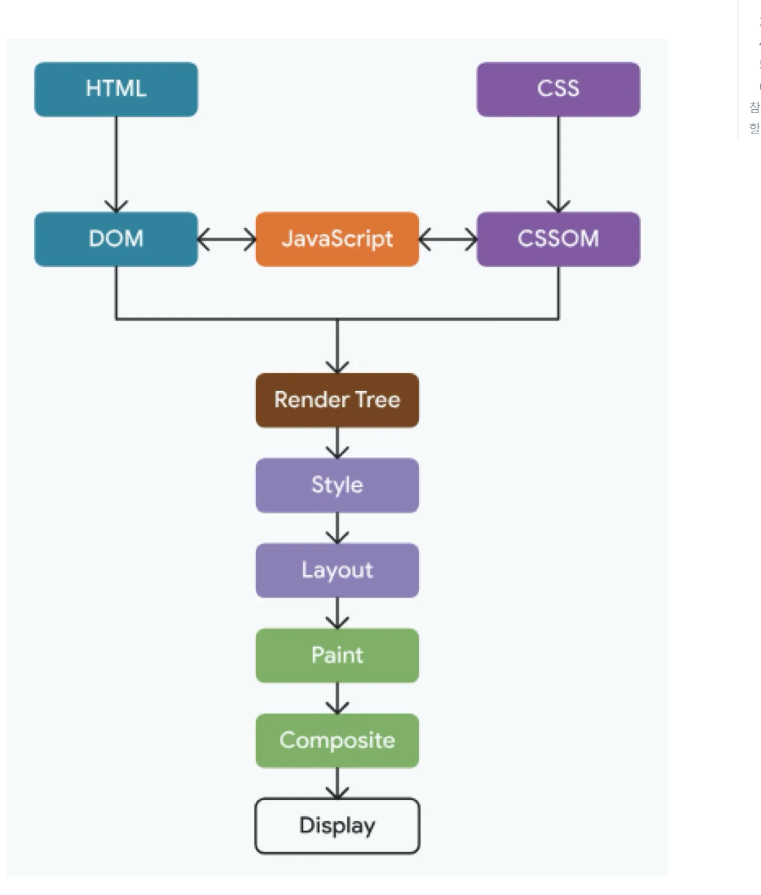

# 브라우저의 렌더링

1. HTML 파싱 및 DOM 트리 생성
   1. HTML 파일을 읽고 DOM 트리를 생성한다.
   2. DOM 트리는 HTML 문서를 계층적으로 표현한 트리 구조로, HTML 문서의 각 요소(태그) , 속성, 텍스트는 DOM 트리에서 하나의 노드로 표현된다. 이 트리구조 덕분에, 부모-자식, 형제노드간의 관계를 파악할 수 있으며, 쉽게 요소를 탐색하거나 수정이 가능하다
2. CSS 파싱 및 CSSOM 트리생성
   1. HTML을 파싱해 DOM 트리를 생성했다면, 이제는 CSS 파일을 읽어 CSSOM 트리를 생성한다, CSSOM은 브라우저가 CSS를 파싱하여 트리구조로 표현한 객체 모델이다, HTML 문서의 각 요소에 적용된 CSS t스타일 규칙을 나타내어 DOM과 결합해 화면에 렌더링할 준비
3. 렌더 트리 형성
   1. CSS를 파싱해 CSSOM까지 생성 시 브라우저는 이제 DOM과 CSSOM을 결합, 렌더트리를 생성한다. 렌더트리는 화면에 표시될 요소만 포함하며, 각 요소에 적용될 스타일과 위치에 대한 정보를 담는다
4. 레이아웃
   1. 텐더 트리가 생성되면 브라우저는 각 요소에 위치와 크기를 계산하는 레이아웃 단계에 들어간다, 이 과정에서는 요소가 화면에 어디에 위치할지, 그리고 어떤 크기를 가질지를 결정한다.
5. 페인트
   1. 레이아웃 단계 이후 브라우저는 요소의 스타일과 내용을 바탕으로 화면에 픽셀을 그린다. 이 단계를 페인트 단계라고 부르며, 레이아웃 단계에서 계산된 요소들의 위치와 크기를 참고, 각 요소에 적용된 스타일속성을 시각적으로 표현, 즉 각 요소의 시각적 속성을 기반으로 픽셀데이터를 생성하며, 데이터들은 화면에 표시될 준비를 하는 단계이다.
   2. 페인트 과정에서 브라우저는 각 요소의 시각적인 속성을 기반으로 페인트 레이어를 생성한다, 요소의 특성을 따라 독립적인 레이어가 생성이 될 수 있다.
6. 컴포지팅
   1. 여러개의 레이어는 컴포지팅 단계에서 하나의 화면으로 결합된다.
   2. 각 레이어를 올바른 순서로 합성, 화면에 정확히 렌더링하게 된다. 특히 요소가 겹치는경우 z-index 나 position 같은 속성을 고려, 겹침순서를 처리한다.
7. 화면
