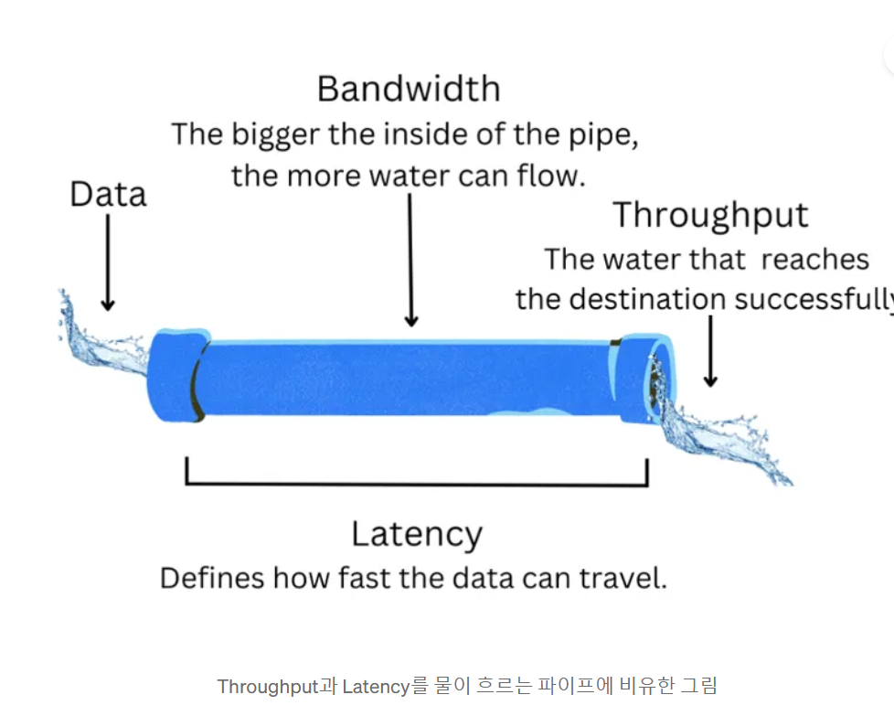

# 서비스의 성능 분석하기

### 성능 평가란?

IT 서비스 백앤드 관점에선 ‘동시 접속자 몇 명까지 안정적으로 서비스를 제공할 수 있어야 한다’, ‘몇 초 이내로 페이지 로딩이 완료되어야 한다’와 같은 성능 요구사항이 존재, 어떤 서비스나 시스템이 이런 요구사항을 잘 충족하고 있는지 확인하고 개선할 부분을 찾는 과정이다.

### 성능평가의 기준

성능 평가에서 활용되는 대표적인 지표는 Throughput 와 Latency가 있다. **어떤 시스템의 성능이 좋아졌다 라는 말은 같은시간 동안 더 많은 작업을 처리한다, 또는 하나의 작업을 빠르게 처리한다 두가지를 의미** 할수 있다

### Throughput

처리량이라고도 하며, 어떤 시스템이 단위시간동안 처리 할 수있는 데이터나 작업의 양을 의미한다, 일반적으로 단위 시간으로 초를 처리할 작업으로 Transaction 을 많이 사용하며 초당 처리량을 TPS라고 표현한다, 최대 처리량이 클시 성능이 좋다고 할 수 있다

Throughput는 처리의 대상이 되는 작업의 종류에 따라 표현하는 방법이 달라질 수 있따.

**작업별 Throughput의 표현**

* CPU :IPS(Instruction Per Second)
* Network : BPS (Byte Per Second)
* Storage : IOPS (Input/Output Per Second)
* Web SErvice : RPS (Request Per Second)

BandWidth 와 Throughput의 관계에서 **전체서비스 의 처리량은 가장작은 처리량보다 클수 없다** 라는것이다.

### Latency

작업을 처리하는데 걸리는 시간을 의미한다, 관점마다 차이가 존재하는데, 서버의 관점에서 보면 요청을 처리하고 응답하느데 걸리는시간을 의미하고 클라이어트 관점에선 HTTP요청을 보내고 응답을 받을때 까지 걸린시간을 의미한다.

**Latency**의 특징

* 작을수록 성능이 좋다
* 한서비스의 전체 Latency는 각 부분 시스템의 Latency를던한것과 같다
* 부분시스템에서 병목이 생긴 경우 이를 대기하는시간도 포함이다

## 정리

* 성능 평가란 서비스나 시스템이 성능 요구사항을 잘 충족하고 있는지를 확인하고 개선할 부분을 찾는 과정이다.
* 성능을  평가하는기준이 되는 지표로른 Throughput과 Latency가 있다.
* Throughput를 개선한다는 것은 같은 시간 동안 더 많은 작업을 처리한다는 것이다
* Latency를 개선한다는 것은 하나의 작업을 더 빠르게 처리
* 부분 시스템의 Throughput과 Latency를 개선함으로써 전체 시스템의 성능도 향상 시킬 수 있다.
