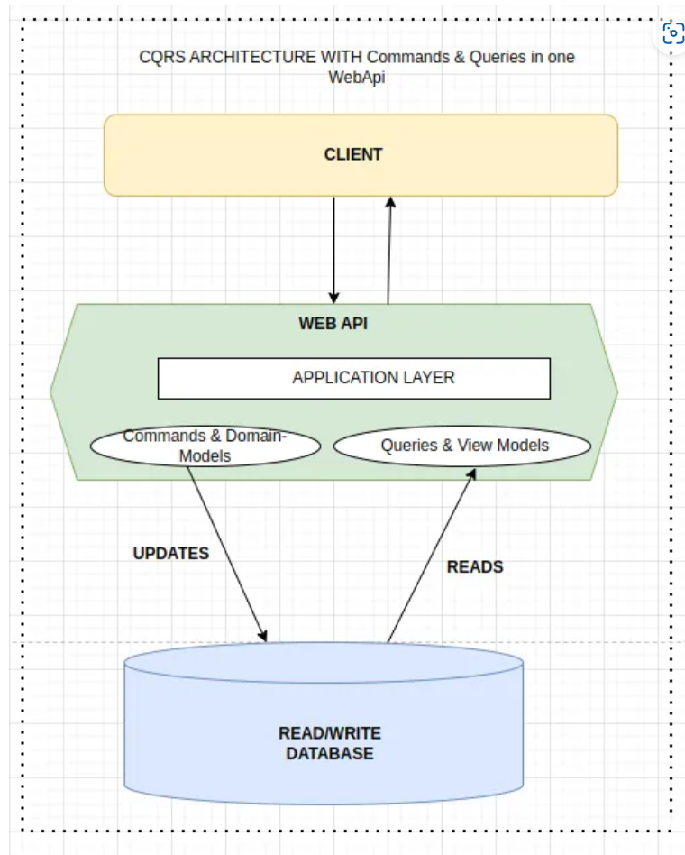

[CQRS Architecture: How It Works. CQRS, or Command Query Responsibility… | by Mandalchandan | Medium](https://medium.com/@90mandalchandan/cqrs-architecture-how-it-works-5f18a36886ea)

# CQRS 아키텍처: 작동 방식

데이터를 읽고 쓰기 위해 별도의 모델을 사용하는 방식이다, CQRS는 소프트웨어 아키텍처 설계와 그안의 상호작용에 접근하는 방식을 근본적으로 변화시킨다

일반적으로 API 서버를 두고 DB를 하나두고 하는경우 모든 클라이언트가 동일한 데이터 구조로 작업하며, 데이터 엑세스, 업데이틍 대한 경쟁이 많지않은경우에는 효과적이다, 단일 도메인 모델은 데이터를 관리하고, 도메인 개체로 표시하고, 업데이트하는동안 일관성을 유지할 수있다. 그러나 서로 다른 클라이언트가 데이터에 대한 고유한 보기를 필요로하거나, 데이터에 대한 엑세스가 많거나, 여러 클라이언트가 동시에 업데이트 하는 경우 문제가 발생하며, 잠재적인 충돌을 야기한다.

### CQRS 핵심원칙

데이터 읽기와 쓰기를 위한 모델을 구별하는 아키텍처 패턴이다, 

*쿼리* : 읽기 결과를반환하고, 시스템 상태를 변경하지 않으며 부작용이 없다

*명령* : 시스템의 상태를 변경한다.

**CQRS의 핵심 개념은 데이터를 읽고 쓰는데 동일한 코드나 논리를 사용하지 않는다** 라는 것이다. 

### CQRS 읽기 및 쓰기 모델분리

CQRS 에서는 쿼리 작업을 한 계층에서 구성하고 명령 잡업을 다른 계층에서 구성하여 문제를 분리한다, 각 계층에는 고유한 데이터 모델이 있으며, 서로 다른 패턴과 기술을 사용 할 수있다, 또는 API 서버를 따루두어서 분할하고 성능에 영항을 주지 않도록 독립적으로 최적화 하고 확장이 용이하게 할 수있다.

또한 더 큰 격리를 위해 읽기 데이터와 쓰기 데이터를 물리적을 분할하여 구성 할 수있다, 이 경우 읽기 데이터베이스는 쿼리에 최적화된 자체 데이터 스키마를 사용하는데, 예를 들면 복잡한 조인 또는 복잡한 ORM 매핑을 피하기 위해 데이터의 구체화된 뷰를 저장할 수있다.
