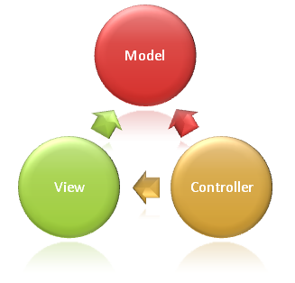

# MVC 패턴이란

### 예시) 로그인 뷰 컨트롤 유저정보 모델

1. 사용자로 부터 Id 와 Password 값을 받는다
2. 뷰를 통해 입력된 모델의 데이터를 컨트롤로 데이터가 넘어온다
3. 컨트롤러에서 처리
4. 뷰로 데이터를 재 전송
5. Models 은 이동수단
6. View는 Controller 로받은 Model 을 기반으로 뷰를 그림

사용자 => 컨트롤러에게 요청

컨트롤러 => 최종사용자에게 응답

View => 응답결과를 화면으로 출력

Model => 최종사용자로부터 컨트롤러를 거쳐 뷰까지 데이터를 이동

### 개요

어플리케이션을 모델, 뷰, 컨트롤러 란느 세가지 주요 구성요소로 구분한다. 이 패턴은 **문제를 분리하는데** 도움이 된다. 

사용자요청은 모델 작업을 담당하는 컨트롤러에게 라우팅이 되어 사용자 작업을 수행하고 컨트롤러는 사용자에게 보여줄 뷰를 선택하고 뷰에 필요한 모델 데이터를 제공한다.

### 모델의 책임

어플리케이션 및 비지니스 처리를 통해 수행해야 하는 작업의 상태를 나타낸다. 비지니스 로직은 어플리케이션의 상태를 유지하기위해 구현 논리와 함께 모델에 캡슐화가 되어야한다. 강력한 보기는 일반적으로 View 에 표시할 데이터를 포함하도록 디자인된 ViewModel 형식을 사용한다. 컨트롤러는 모델에서 이러한 ViewModel인스턴스를 만들고 채운다

### View 의 책임

Razor 보기 엔진을 사용하며 HTML 태그에 .Net 코드를 포함한다. 내부의 논리르 최소화로 해야하며, 복잡한 모델의 데이터를 표시하기 위해 보기에서 다량의 논리를 수행해야 하는 경우 ViewModel또는 보기 템플릿을 사용하여 보기를 간소화 하는 방안을 고려해야한다.

### Controller의 책임

사용자의 상호 작용을 처리하고, 모델을 작업하고, 궁극적으로 렌더링할 View를 선택하는 구성요소이다. MVC 어플리케이션에서 보기는 정보만 표시한다. 컨트롤러가 사용자 입력 및 상호 작용을 처리하고 응답한다. MVC패턴에서 컨트롤러는 초기 진입점으로, 작업할 모델과 렌더링할 view를 선택할 책임이 있다.
=======
# MVC 패턴이란

### 예시) 로그인 뷰 컨트롤 유저정보 모델

1. 사용자로 부터 Id 와 Password 값을 받는다
2. 뷰를 통해 입력된 모델의 데이터를 컨트롤로 데이터가 넘어온다
3. 컨트롤러에서 처리
4. 뷰로 데이터를 재 전송
5. Models 은 이동수단
6. View는 Controller 로받은 Model 을 기반으로 뷰를 그림

사용자 => 컨트롤러에게 요청

컨트롤러 => 최종사용자에게 응답

View => 응답결과를 화면으로 출력

Model => 최종사용자로부터 컨트롤러를 거쳐 뷰까지 데이터를 이동

### 개요
[[1.1.Asp.NetCore개요]]

어플리케이션을 모델, 뷰, 컨트롤러 란느 세가지 주요 구성요소로 구분한다. 이 패턴은 **문제를 분리하는데** 도움이 된다. 

사용자요청은 모델 작업을 담당하는 컨트롤러에게 라우팅이 되어 사용자 작업을 수행하고 컨트롤러는 사용자에게 보여줄 뷰를 선택하고 뷰에 필요한 모델 데이터를 제공한다.

### 모델의 책임

어플리케이션 및 비지니스 처리를 통해 수행해야 하는 작업의 상태를 나타낸다. 비지니스 로직은 어플리케이션의 상태를 유지하기위해 구현 논리와 함께 모델에 캡슐화가 되어야한다. 강력한 보기는 일반적으로 View 에 표시할 데이터를 포함하도록 디자인된 ViewModel 형식을 사용한다. 컨트롤러는 모델에서 이러한 ViewModel인스턴스를 만들고 채운다

### View 의 책임

Razor 보기 엔진을 사용하며 HTML 태그에 .Net 코드를 포함한다. 내부의 논리르 최소화로 해야하며, 복잡한 모델의 데이터를 표시하기 위해 보기에서 다량의 논리를 수행해야 하는 경우 ViewModel또는 보기 템플릿을 사용하여 보기를 간소화 하는 방안을 고려해야한다.

### Controller의 책임

사용자의 상호 작용을 처리하고, 모델을 작업하고, 궁극적으로 렌더링할 View를 선택하는 구성요소이다. MVC 어플리케이션에서 보기는 정보만 표시한다. 컨트롤러가 사용자 입력 및 상호 작용을 처리하고 응답한다. MVC패턴에서 컨트롤러는 초기 진입점으로, 작업할 모델과 렌더링할 view를 선택할 책임이 있다.
>>>>>>> 7e3a9ba53e3541e5352ee5579f3ab465cfc162e2
