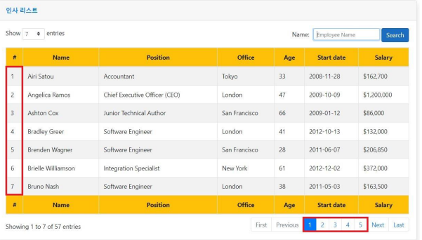

<<<<<<< HEAD
# PagingControlGroup

한 페이지의 행의 갯수는 공식도출이 가능하다?

|#넘버|페이지넘버|공식1|공식2|공식3|
|---|---|---|---|---|
|1|1|0 + 1 => 1| 7 * 0 +1 => 1 |1 / 7 = 0.14 => 1|
|8|2|7 + 1 => 2| 7 * 1 +1 => 2| 8 / 7 = 1.14 => 2|
|15|3|14 + 1 => 3|7 * 3 +1 => 3 | 15 / 7 = 2.14 => 3|
|22|4|28 + 1 => 4|7 * 4 +1 => 4 | 22 / 7 = 3.14 => 4 |
|...|...|...|... |... |

Pagind에서 7개의 항목이 1페이지이므로 7을 변수화 하여 공식에 적용한다.  
C# 에서 Math class가 있고 .Ceiling() Method가 있다.  
여기서 Ceiling 메서드는 안에 파라미터를 넣는 값과 올린 가장 가까운 자연수, 양의 정수를 반환해준다. 해당 키워드로 공식 3을 이용해 페이징을 컨트롤한다

위와 같은 #넘버갯수에 맞는 페이징 그룹을 하기위해 7개의 데이터가 끝나야 다음 페이지를 구성하게 된다. 데이터 인덱스 와 페이징 넘버가 간격이 점점 커진다.  

## 페이징 그룹 방식 과정
1. 큰수를 작으수로 만들 떄는 - 또는 / 를 사용한다.
2. 공식에 사용할 수는 변동없이 일정 해야한다.

## 결론
> PagingGroup = Math.Ceiling(DataNo/ ItemsPerPage)  
> 페이징 그룹이란 = 데이터 인덱스 / 한페이지에 들어갈 아이템수
=======
[[1.1.Asp.NetCore개요]]
# PagingControlGroup

한 페이지의 행의 갯수는 공식도출이 가능하다?

|#넘버|페이지넘버|공식1|공식2|공식3|
|---|---|---|---|---|
|1|1|0 + 1 => 1| 7 * 0 +1 => 1 |1 / 7 = 0.14 => 1|
|8|2|7 + 1 => 2| 7 * 1 +1 => 2| 8 / 7 = 1.14 => 2|
|15|3|14 + 1 => 3|7 * 3 +1 => 3 | 15 / 7 = 2.14 => 3|
|22|4|28 + 1 => 4|7 * 4 +1 => 4 | 22 / 7 = 3.14 => 4 |
|...|...|...|... |... |

Pagind에서 7개의 항목이 1페이지이므로 7을 변수화 하여 공식에 적용한다.  
C# 에서 Math class가 있고 .Ceiling() Method가 있다.  
여기서 Ceiling 메서드는 안에 파라미터를 넣는 값과 올린 가장 가까운 자연수, 양의 정수를 반환해준다. 해당 키워드로 공식 3을 이용해 페이징을 컨트롤한다

위와 같은 #넘버갯수에 맞는 페이징 그룹을 하기위해 7개의 데이터가 끝나야 다음 페이지를 구성하게 된다. 데이터 인덱스 와 페이징 넘버가 간격이 점점 커진다.  

## 페이징 그룹 방식 과정
1. 큰수를 작으수로 만들 떄는 - 또는 / 를 사용한다.
2. 공식에 사용할 수는 변동없이 일정 해야한다.

## 결론
> PagingGroup = Math.Ceiling(DataNo/ ItemsPerPage)  
> 페이징 그룹이란 = 데이터 인덱스 / 한페이지에 들어갈 아이템수
>>>>>>> 7e3a9ba53e3541e5352ee5579f3ab465cfc162e2
