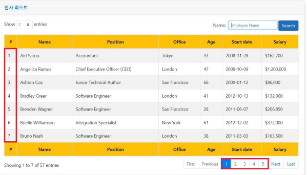

[[1.1.Asp.NetCore개요]]
# StartPage

시작 페이지라는것은 전체 페이지에서 한 페이지 항목이 7개 든 몇개든 상관없이 동작하는것이다.  
페이징의 시작은 하단의 페이징 컨트롤 숫자 링크 (위 이미지상 1~ 개) `1`  만약 위에서 5가넘어갈시 `6` 이 시작 페이지이다.  
해당 숫자가 시작페이지라는것을 공식으로 도출을 하려는 것이다.  
예를들면  
* 1 ~ 5페이지의 첫번 째 페이지숫자는 1 공식 => ** 
* 6 ~ 10페이지의 첫번 째 페이지 숫자는 6
* 11 ~ 15페이지의 첫번 째 페이지 숫자는 11
* ... **이런식으로 페이징 컨트롤에서의 시작 페이지는 하단의 페이지 목록의 첫번째 인덱스이다.**
* 공식을 찾아서 변수를 적용하여 알고리즘을 찾아서 시작페이징으 을 찾는다.
  
## 결론
이전에 사용햇던 공식을 사용. 
> PagingGroup = Math.Ceiling(DataNo/ ItemsPerPage)  
> StartPage = (PagingGroup * NumberLinksPerPage) - NumberLinksPerPage + 1  
> 스타트 페이징 그룹이란 = (데이터 인덱스(x) / 한페이지에 들어갈 아이템수(7))* 페이징 목록의 아이템수(5) - 페이징 목록의 아이템수(5) + 1  
> 1~5 => 1, 6~10 => 6, 11~16 => 11