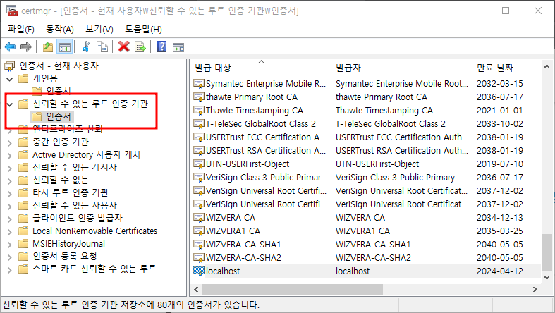

<<<<<<< HEAD
# Https에 대한구성

## Https 통신

**Http 메세지가 암호화 되어 송/수신 되는방식**

[Https 에 대한 구성]옵션은 웹 어플리케이션이 https 통신을 할지 말지 결정하는 것이다 이 옵션이 선택된다면 Https통신을 위한 기반자원들이 설정되고 그에 사응하는 뼈대 코드가 프로잭트에 삽입

Https 통신을 위한 기반 자원중에 가장 중요한것은 **SSL 인증서** 이다. 왜냐하면 Https 통신 과정은 SSL 인증서를 교환하는 절차가 포함 되어 있다. 그래서 상용 서비스를 하기 위해서는 반드시 필요한 항목이고 유료로 구매해야한다.

### 개발용 인증서

무료 인증서는 보통 OpenSSL 이라는 도구를 이용하여 생성, [Https 에 대한 구성] 옵션이 선택시, 비주얼 스튜디오는 개발 PC에게 "개발용 인증서"가 있는지 검색하고 없다면 생성해준다. 이 인증서는 발급자와 발급대상이 다르지만, 개발용 인증서는 모두 "localhost"로 동일하게 표기되어진다.

자신을 위해 발급한 인증서를 *자가 서명 인증서*라고 하는데 개발용 인증서들이 보편적으로 갖는 특성이다. 인증서들은 Https 통신이 시작 시, 서버에 브라우져를 전달되고 이 인증서를 검증한다. 브라우저가 인증서를 검증하는 이유는 현재 접속중인 도메인(URL)의 소유자가 제공된 인증서의 발급 대상자 와 일치하는지 확인을 위한 것이다.

즉, 통신 상대방이 진짜 URL 소유자인지 아닌 지 확인하기 위해서 이다.

URL 소유자가 확인 시 서버와 브라우져는 향후 주고받을 메세지를 암호화할 비밀키를 공유한다, 그 다음부터는, 송신측 공유된 비밀키로 메세지를 암호화 한 후 송신하고, 수신측은 비밀키로 복원해서 메시지를 확인한다.

이것이 Https를 통해 이루어지는 암호화 통신의 대략인다.

## 신뢰 할 수 있는 루트 인증기관

인증서 저장 폴더 중 가장 중요한 곳은 [신뢰할 수 있는 루트 인증기관]이다.

인증서들을 저장하는 곳이다. 

이폴더가 발급자인 "localhost"를 신뢰하는 루트 인증기관으로 격상시키면 신뢰하는 루트 발급자로 둔갑하게된다. 

브라우져는 https 통신을 개시할 때 서버로부터 받은 인증서의 발급자가 신뢰할 수 있는 지를 확인하는데, 그근거는 이폴더의 파일이다. 이효과는 그 PC에만 해당된다 만약 개발용 인증서가 모든전세계의 PC의 해당 폴더에 설치한다면 유료와 다른점은 없다. 윈도우의 경우, 개발용 인증서를 [신뢰할 수 있는 루트 인증 기관]폴더에 옮기는 작업은 내보내기 가져오기기능을 통해 처리할 수있다.

앱은 개인용-보증서 폴더에 있는 개발용 인증서를 https 통신 개시 시점에 브라우저에게 보낸다. 이를 받은 브라우저는 

1. 인증서의 발급자가 [신뢰할 수 있는] 폴더의 발급자인지 확인한다.
2. 확인이 된다면, 개발용 인증서를 신뢰하고, 그 인증서의 발급 대상자인 localhost를 origin이라고 판단
=======
[[1.1.Asp.NetCore개요]]
# Https에 대한구성

## Https 통신

**Http 메세지가 암호화 되어 송/수신 되는방식**

[Https 에 대한 구성]옵션은 웹 어플리케이션이 https 통신을 할지 말지 결정하는 것이다 이 옵션이 선택된다면 Https통신을 위한 기반자원들이 설정되고 그에 사응하는 뼈대 코드가 프로잭트에 삽입

Https 통신을 위한 기반 자원중에 가장 중요한것은 **SSL 인증서** 이다. 왜냐하면 Https 통신 과정은 SSL 인증서를 교환하는 절차가 포함 되어 있다. 그래서 상용 서비스를 하기 위해서는 반드시 필요한 항목이고 유료로 구매해야한다.

### 개발용 인증서

무료 인증서는 보통 OpenSSL 이라는 도구를 이용하여 생성, [Https 에 대한 구성] 옵션이 선택시, 비주얼 스튜디오는 개발 PC에게 "개발용 인증서"가 있는지 검색하고 없다면 생성해준다. 이 인증서는 발급자와 발급대상이 다르지만, 개발용 인증서는 모두 "localhost"로 동일하게 표기되어진다.

자신을 위해 발급한 인증서를 *자가 서명 인증서*라고 하는데 개발용 인증서들이 보편적으로 갖는 특성이다. 인증서들은 Https 통신이 시작 시, 서버에 브라우져를 전달되고 이 인증서를 검증한다. 브라우저가 인증서를 검증하는 이유는 현재 접속중인 도메인(URL)의 소유자가 제공된 인증서의 발급 대상자 와 일치하는지 확인을 위한 것이다.

즉, 통신 상대방이 진짜 URL 소유자인지 아닌 지 확인하기 위해서 이다.

URL 소유자가 확인 시 서버와 브라우져는 향후 주고받을 메세지를 암호화할 비밀키를 공유한다, 그 다음부터는, 송신측 공유된 비밀키로 메세지를 암호화 한 후 송신하고, 수신측은 비밀키로 복원해서 메시지를 확인한다.

이것이 Https를 통해 이루어지는 암호화 통신의 대략인다.

## 신뢰 할 수 있는 루트 인증기관

인증서 저장 폴더 중 가장 중요한 곳은 [신뢰할 수 있는 루트 인증기관]이다.

인증서들을 저장하는 곳이다. 

이폴더가 발급자인 "localhost"를 신뢰하는 루트 인증기관으로 격상시키면 신뢰하는 루트 발급자로 둔갑하게된다. 

브라우져는 https 통신을 개시할 때 서버로부터 받은 인증서의 발급자가 신뢰할 수 있는 지를 확인하는데, 그근거는 이폴더의 파일이다. 이효과는 그 PC에만 해당된다 만약 개발용 인증서가 모든전세계의 PC의 해당 폴더에 설치한다면 유료와 다른점은 없다. 윈도우의 경우, 개발용 인증서를 [신뢰할 수 있는 루트 인증 기관]폴더에 옮기는 작업은 내보내기 가져오기기능을 통해 처리할 수있다.

앱은 개인용-보증서 폴더에 있는 개발용 인증서를 https 통신 개시 시점에 브라우저에게 보낸다. 이를 받은 브라우저는 

1. 인증서의 발급자가 [신뢰할 수 있는] 폴더의 발급자인지 확인한다.
2. 확인이 된다면, 개발용 인증서를 신뢰하고, 그 인증서의 발급 대상자인 localhost를 origin이라고 판단
>>>>>>> 7e3a9ba53e3541e5352ee5579f3ab465cfc162e2
