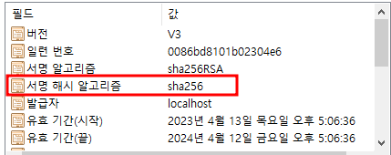
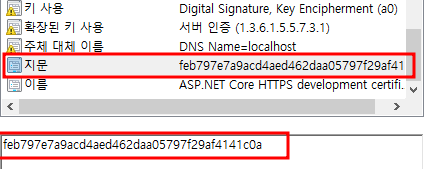

[[1.1.Asp.NetCore개요]]
# 인증서

인증서란 인증서 소유자에 대한 확인서와 같다

인증서
일련번호 : 20220921 - 1
발급 대상자 : [www.biden.com](http://www.biden.com/)
발급 대상자는 진실함을 확인함.
발급자 : [www.mmbbcc.com](http://www.mmbbcc.com/)

발급 대상자가 인증서를 통해 확인되는 소유자이다.

인증서는 크게 두가지 보안문제가 있다.

1. 인증서의 위조
   * 인증서가 발급된 후, 이증서의 내용 중 일부, 주로 발급 대상자를 위조하는것
1. 발급자의 권위
   * 발급자에게 신망이 없는 경우, 인증서는 문서 쪼가리에 지나지 않는다

인증서는 이런 보안 위험에 대한 검증장치를 포함하는데 이를 **디지털 서명** 을 사용한다

## 디지털 서명

수기 서명을 디지털 방식으로 변환한 것으로, 해시 알고리즘과 공개키 암호화 방식을 사용.

### 해시알고리즘

수학적 알고리즘으로 가변 길이 문자열을 단일 길이의 문자열로 변환한다.

* 입력과 출력이 고유한 관계
* 동일한 입력에 대한 항상 동일한 출력을 제공
* 출력으로부터 입력을 유추할수 없다.

### 인증서 지문

인증서 발급자는 최초로 얻은 해시값을 암호화 하여 인증서에 삽입하는데, 이 암호화된 해시값이 인증서의 "지문" 항목에 저장, 해시값을 지문으로 변환시 사용되는 암호화 방식은 공개키 알고리즘이다.

### 공개키 알고리즘

비대칭키 방식으로불리면, 평문을 암호문으로 변화하는 키와 암호문을 평문으로 복원하는 키가 분리된 암호화 방식이다. 

여기서 key는 비밀번호와 같은의미이다.

공개키 방식에서는,

**평문키를 암호문으로 변환시 사용하는키를 개인키**

**암호문을 평문키로 변환하는 키를 공개키**

인증서 항목의 이름을 보면 해시값을 암호화 하는데 사용한 알고리즘을 *서명 알고리즘* 으로 부르는데 이를 통해 인증서에는 ***해쉬 값을 암호화하는 것을***  디지털 서명 이라고 부른다.

### 위조 검증

인증서 수취인이 인증서를 검증하는 방식

1. 인증서에 표시된 해시 알고리즘을 사용하여 인증서의 해시값을 구한다.
2. 인증서에 표시된 공개키 알고리즘과 공개키를 사용하여, 지문을 복원해서 원래 해시값을 구한다.

두 해쉬값이 같다면, 인증서는 발급시점으로부터 지금까지 변조된 적이 없다는 의미 그런데, 위조 가능성에대해 알아보자

위조자가 인증서를 위조 후 위조된 인증서의 해시값을 구하고, 이를 자신만의 개인키로 서명한 다음, 위조 개인키와 쌍을 이루는 위조 공개키를 인증서에 넣으면 여전히 위조 가능성은 열려있다 할수있다.

### 발급자의 권위

SSL 인증서를 통한 인증시스템을 떠받는 핵심은 인증서 자체가아니라 발급자의 권위라고 할수 있다.

신뢰받는 기관들은 자신의 루트 인증서가 오염되지 않은 채 운영체제에게 전달됨을 보증하고, 운영체제는 전달받은 루트 인증서가 위조되지 않았음을 보증한다. 인증서에 삽입된 지문, 공개키, 공개키알고리즘은 누구나 볼 수 있어 이를 이용해 원래의 해쉬값을 복원하는것은 쉬운일이다.

그러나 **개인키**는 알 수 없다 해당 알고리즘은 평문 - 개인키 - 암호문 - 공개키의 조합이 유일함을 보장한다. 이로인해, 위조는 권위 있는 루트 발급자의 원래 공개키로 인해 위조가 금방 드러난다.

>  위조자가 인증서를 위조한다음, 위조돈 인증서의 해쉬값을 구하고 이를 자기만의 개인키로 서명한다음, 위조 개인키와 쌍을 이루는 위조 공개키를 인증서에 넣는다면, 여전히 위조가능성은 열려있다.
