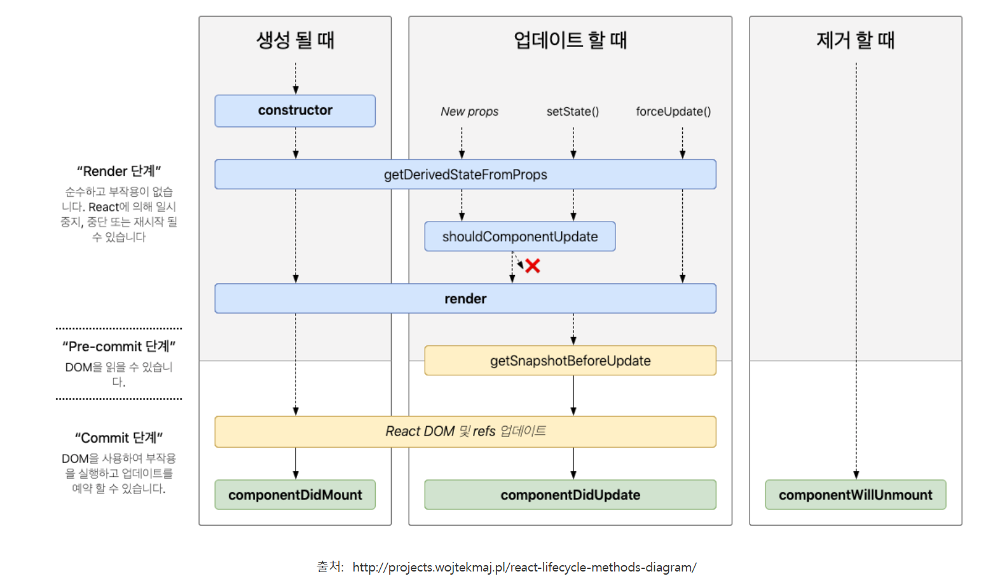

# React useEffect 개념 및 사용 방법

모든 컴포넌트는 생명주기가 있다. 생명주기가 있다는 의미는 모든 컴포넌트가 렌더링 될때 특정 작업을 실행할 수 있도록 하는 Hook이다, 즉 클래스형 컴포넌트에서 사용할 수있엇던 생명주기 메소드를 함수형 컴포넌트에서도 사용이 가능하다.

useEffect는 구성요소를 외부 시스템과 동기화 할수있는 React Hook이다



## useEffect() 사용법

기본형태

**useEffect(function, deps)**

* function : 수행하고자 하는 작업
* deps : 배열 형태이며, 배열안에는 검사하고자 하는 특정값 or 빈 배열

useEffect 함수 불러오기

```js
 useEffect(() => {
    console.log('마운트 될 때만 실행된다');
  }, []);
```

Component가 mount 됬을때 (처음 렌더링)

```js
  useEffect(() => {
    console.log('렌더링 될 때 마다 실행된다');
  });
 useEffect(() => {
    console.log(name);
    console.log('업데이트 될 때 실행된다');
  }, [name]);
```

**Component가 update 될 때 (특정 props, state가 바뀔 때)**

- 특정값이 업데이트 될 때 실행하고 싶을 때는 deps 위치의 배열 안에 검사하고 싶은 값을 넣어준다.

(의존값이 들어있는 배열 deps 이라고도 한다. dependency를 의미.)

- 업데이트 될 때만 실행하는 것이 아니라 마운트 될 때도 실행된다.

따라서 업데이트 될 때만 특정 함수를 실행하고 싶다면 아래와 같은 꼼수?를 사용하면 좋다.

```js
//코드 생략

const mounted = useRef(false);

useEffect(() => {
  if(!mounted.current){
    mounted.current = true;
  } else {
  //ajax
  }
},[바뀌는 값]);

//코드 생략
```
